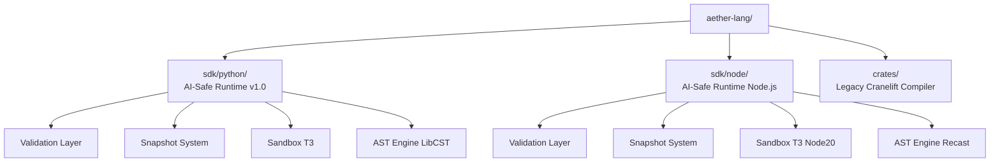
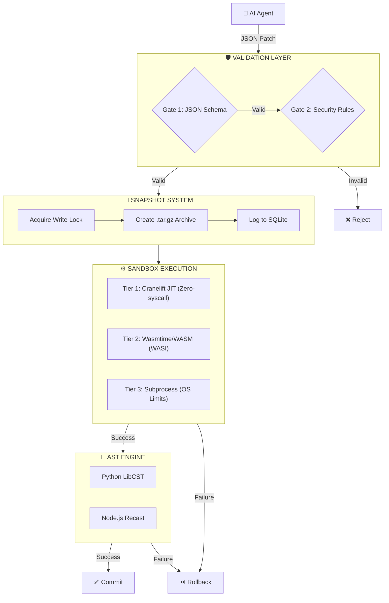

# Aether → AI-Safe Execution Infrastructure

> **This repository has evolved from a Cranelift-based systems language compiler into an AI-Safe Execution Infrastructure — a structured, sandboxed, and reversible runtime for AI-driven code modification.**

---

## What is this?

AI coding agents (LLMs, Copilots, AutoGPT, etc.) currently modify codebases by generating raw text diffs or source code and applying them directly. This is fundamentally unsafe:

- No schema — the change is freeform text with no verifiable structure
- No isolation — the change executes in the live process with full filesystem access
- No rollback — recovery depends on `git reset` or manual intervention
- No contract — ambiguity about what the agent intended vs. what it wrote

**AI-Safe Execution Infrastructure** fixes this by treating AI code modification as a **controlled state transition problem** rather than a text generation problem.

```
❌ Before:  AI agent ──(raw diff)──▶ git apply ──▶ hope it works

✅ After:   AI agent ──(Patch JSON)──▶ Validate ──▶ Snapshot ──▶ Sandbox ──▶ Commit/Rollback
```

---

## Repository Layout



```
aether-lang/
│
├── sdk/python/                  ← AI-Safe Runtime (Python SDK, v1.0)
│   ├── ai_runtime/
│   │   ├── patch_engine.py      ← PatchEngine: validate() + apply() orchestrator
│   │   ├── sandbox.py           ← Sandbox: T1/T2/T3 tier dispatcher
│   │   ├── sandbox_t3.py        ← T3: subprocess + OS resource limits
│   │   ├── sandbox_runner.py    ← Worker script (runs inside child process)
│   │   ├── _types.py            ← Shared dataclasses
│   │   ├── validation/
│   │   │   ├── patch_schema.json  ← JSON Schema Draft 2020-12 contract
│   │   │   ├── schema.py          ← Gate 1: schema validation
│   │   │   └── rules.py           ← Gate 2: security allow-list
│   │   └── snapshot/
│   │       ├── store.py           ← SnapshotStore: capture/restore/commit/prune
│   │       ├── gitignore.py       ← .gitignore-aware file collector
│   │       └── lock.py            ← Cross-platform write lock
│   └── tests/                   ← 94 tests, all passing
│
├── crates/                      ← Legacy: Aether language compiler (Rust/Cranelift)
│   ├── ae/                      ← CLI binary (ae run, ae build)
│   ├── ae-codegen/              ← Cranelift JIT + AOT backend (future T1 sandbox)
│   ├── ae-sema/                 ← Semantic analysis
│   └── ae-syntax/               ← Parser / AST
│
└── architecture doc/
    └── AI-Safe-Execution-Infrastructure-Documentation.md
```

---

## System Architecture



---

## Python SDK — Quick Start

```bash
pip install ai-safe-runtime
```

```python
import uuid
from ai_runtime import PatchEngine, Sandbox

# 1. Build a structured patch
patch = {
    "schema_version": "1.0",
    "patch_id": str(uuid.uuid4()),
    "action": "modify_function",
    "target": {
        "file": "src/app.py",
        "symbol": "calculate_total",
        "symbol_type": "function",
    },
    "changes": {
        "operation": "replace_body",
        "payload": "    return sum(items)",
    },
}

# 2. Validate — two-gate, < 1ms
engine = PatchEngine()
report = engine.validate(patch)

if report.ok:
    # 3. Snapshot — capture project state
    sb     = Sandbox(project_root=".")
    handle = sb.snapshot(patch_id=patch["patch_id"])

    # 4. Apply + check execution result
    result = engine.apply(patch)

    if result and result.failed:
        sb.restore(handle)           # 5a. Rollback on failure
    else:
        sb.commit_snapshot(handle)   # 5b. Commit on success
else:
    print(f"Rejected: {report.first_error}")
```

**Full SDK documentation:** [`sdk/python/README.md`](sdk/python/README.md)

---

## Patch Schema Reference

All patches must conform to the JSON Schema at [`sdk/python/ai_runtime/validation/patch_schema.json`](sdk/python/ai_runtime/validation/patch_schema.json).

| Field | Required | Description |
|:------|:---------|:------------|
| `schema_version` | ✅ | `"1.0"` |
| `patch_id` | ✅ | UUID v4 — for idempotency and audit |
| `action` | ✅ | One of 7 supported actions |
| `target.file` | ✅ | Relative path — no `/` prefix, no `..` |
| `changes.operation` | ✅ | Must be in allow-list for the action |
| `changes.payload` | ✅ | Source code, max 64 KB |
| `constraints.timeout_ms` | ○ | 100 – 30000 ms |
| `constraints.memory_limit_mb` | ○ | Memory cap for sandbox |
| `metadata.*` | ○ | Agent provenance, model, confidence |

---

## Why Cranelift?

The original goal of this repo was to build **Aether** — a compiled systems language using Cranelift as the backend. That work proved that:

1. Cranelift can be embedded in Rust and driven purely from safe Rust code
2. JIT compilation via `cranelift-jit` produces native code with zero syscall overhead
3. The `JITModule` and `ObjectModule` share the same `Module` trait — one lowering pass serves both JIT and AOT

These properties make the existing `crates/ae-codegen` the ideal **T1 sandbox backend** — a Cranelift JIT that executes AI-generated code with no syscall surface whatsoever, accessible from the Python SDK via FFI.

The T1 tier is planned for v1.2 and will reuse the Cranelift infrastructure already built here.

---

## Test Suite

```bash
cd sdk/python
pip install -e ".[dev]"
pytest tests/ -v
```

```
94 passed in 4.92s
├── test_validation.py        34 tests  (Phase 1: Validation Layer)
├── test_sandbox.py           26 tests  (Phase 2: Sandbox T3)
├── test_sandbox_t3_windows.py 3 tests  (Phase 2: Windows Job Objects)
└── test_snapshot.py          31 tests  (Phase 3: Snapshot System)
```

---

## Roadmap

| Phase | Component | Status |
|:------|:----------|:-------|
| 1 | Validation Layer (JSON Schema + Rules) | ✅ Complete |
| 2 | T3 Sandbox (subprocess + OS limits) | ✅ Complete |
| 3 | Snapshot System (tar.gz + SQLite + locks) | ✅ Complete |
| 4 | Observability (audit log, diffs, CLI status) | ✅ Complete |
| 5 | AST Apply Engine (`modify_function` via `ast`/`libcst`) | ✅ Complete |
| 6 | Node.js SDK (`sdk/node/`) | ✅ Complete |
| 7 | T2 Sandbox (Wasmtime/WASI) | 🔜 Planned |
| 8 | T1 Sandbox (Cranelift JIT FFI) | 🔜 Planned |

---

## Requirements

- **Python SDK**: Python ≥ 3.11, no Docker, no root
- **Rust compiler**: Required only to rebuild `crates/` (`rustup target add x86_64-pc-windows-gnu`)
- **Platforms**: Windows 10+, Linux, macOS

---

## License

MIT
