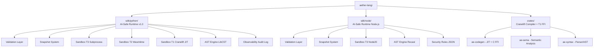
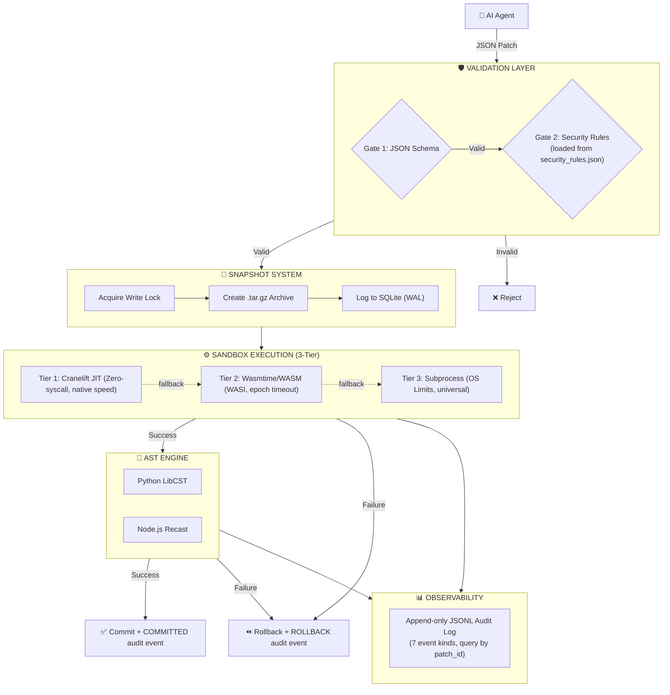

# Aether → AI-Safe Execution Infrastructure

> **This repository has evolved from a Cranelift-based systems language compiler into an AI-Safe Execution Infrastructure — a structured, sandboxed, and reversible runtime for AI-driven code modification.**

---

## What is this?

AI coding agents (LLMs, Copilots, AutoGPT, etc.) currently modify codebases by generating raw text diffs or source code and applying them directly. This approach—relying entirely on **token generation**—is fundamentally expensive, brittle, and unsafe:

- **Expensive Token Generation:** Agents waste context window and compute re-generating entire files or large chunks of code just to change a few lines.
- **No Schema:** The change is freeform text with no verifiable structure.
- **No Isolation:** The change executes in the live process with full filesystem access.
- **No Rollback:** Recovery depends on `git reset` or manual intervention.
- **No Contract:** Ambiguity about what the agent intended vs. what it wrote.

**Aether's AI-Safe Execution Infrastructure** introduces a massive architectural shift: **moving from token generation to AST-based state transitions.**

Instead of asking an LLM to "write code", you ask it to output a compact JSON patch describing the *logical* changes (e.g., "replace the body of function X"). The infrastructure parses the target code into an Abstract Syntax Tree (AST), applies the exact transformations requested, and serialises it back. 

This fixes the fundamental flaws of token-based generation by treating code modification as a **controlled state transition**:

```
❌ Before (Token Generation):  AI agent ──(raw text/diff)──▶ git apply ──▶ hope it works

✅ After (AST State Transition): AI agent ──(JSON AST Patch)──▶ Validate ──▶ Snapshot ──▶ Sandbox ──▶ Commit/Rollback
```

**Why this matters for your Agents:**
- **Massive Cost Efficiency:** You only pay to generate the exact AST instructions needed in a compact JSON payload, not entire files. 
- **Deterministic and Verifiable:** Changes are applied via exact AST transformations (using tools like `libcst`), ensuring syntax is always perfectly valid.
- **Atomic & Reversible:** Because patches are structured state transitions, they can be flawlessly snapshotted and rolled back if sandbox execution fails.

---

## Repository Layout



```
aether-lang/
│
├── sdk/
│   ├── python/                  ← AI-Safe Runtime (Python SDK)
│   │   ├── ai_runtime/
│   │   │   ├── patch_engine.py      ← PatchEngine: validate() + apply() orchestrator
│   │   │   ├── sandbox.py           ← Sandbox: T1/T2/T3 tier dispatcher
│   │   │   ├── sandbox_t1.py        ← T1: Cranelift JIT via ctypes FFI
│   │   │   ├── sandbox_t2.py        ← T2: Wasmtime/WASI WASM sandbox
│   │   │   ├── sandbox_t3.py        ← T3: subprocess + OS resource limits
│   │   │   ├── sandbox_runner.py    ← Worker script (runs inside child process)
│   │   │   ├── _types.py            ← Shared dataclasses (ExecutionResult w/ isolation_level)
│   │   │   ├── validation/
│   │   │   │   ├── patch_schema.json  ← JSON Schema Draft 2020-12 contract
│   │   │   │   ├── schema.py          ← Gate 1: schema validation
│   │   │   │   └── rules.py           ← Gate 2: loads patterns from security_rules.json
│   │   │   ├── snapshot/
│   │   │   │   ├── store.py           ← SnapshotStore: capture/restore/commit/prune
│   │   │   │   ├── gitignore.py       ← .gitignore-aware file collector
│   │   │   │   └── lock.py            ← Cross-platform write lock
│   │   │   ├── ast/                   ← AST Apply Engine (LibCST)
│   │   │   └── observability/         ← Audit log (JSONL), diff, structured events
│   │   └── tests/                   ← 174 tests (all passing, 1 xfailed)
│   │
│   ├── node/                    ← AI-Safe Runtime (Node.js SDK)
│   │   ├── src/
│   │   │   ├── security.ts          ← Loads rules from shared security_rules.json
│   │   │   ├── validation/          ← Ajv JSON Schema + security rules
│   │   │   ├── snapshot/            ← tar.gz snapshots
│   │   │   ├── sandbox/
│   │   │   │   ├── ae_sandbox_napi.cpp  ← N-API C++ wrapper for Rust FFI
│   │   │   │   └── sandbox.js           ← T3 subprocess sandbox
│   │   │   └── ast/                 ← Recast AST engine (JS/TS)
│   │   ├── tests/                   ← Jest tests incl. rollback-fault.test.ts
│   │   └── binding.gyp              ← node-gyp build config for T1 N-API addon
│   │
│   └── security_rules.json      ← Shared security patterns (both SDKs load from here)
│
├── crates/                      ← Aether language compiler (Rust/Cranelift)
│   ├── ae/                      ← CLI binary (ae run, ae build, ae check)
│   ├── ae-codegen/
│   │   ├── src/
│   │   │   ├── lib.rs           ← Tree-walking interpreter (T1 fast path)
│   │   │   ├── jit.rs           ← Cranelift JIT (BoolLit/ArrayLit/Return hardened)
│   │   │   ├── aot.rs           ← Cranelift AOT (same hardening)
│   │   │   └── ffi.rs           ← C-ABI guard ring (ae_sandbox_execute/free)
│   │   └── Cargo.toml           ← cdylib + rlib dual output
│   ├── ae-sema/                 ← Semantic analysis + stability levels
│   └── ae-syntax/               ← Parser / AST (ContentHash via BLAKE3)
│
├── SECURITY.md                  ← Honest threat model for all 3 sandbox tiers
└── README.md                    ← This file
```

---

## System Architecture



---

## Python SDK — Quick Start

```bash
pip install ai-safe-runtime
```

```python
import uuid
from ai_runtime import PatchEngine, Sandbox

# 1. Build a structured patch
patch = {
    "schema_version": "1.0",
    "patch_id": str(uuid.uuid4()),
    "action": "modify_function",
    "target": {
        "file": "src/app.py",
        "symbol": "calculate_total",
        "symbol_type": "function",
    },
    "changes": {
        "operation": "replace_body",
        "payload": "    return sum(items)",
    },
}

# 2. Validate — two-gate, < 1ms
engine = PatchEngine()
report = engine.validate(patch)

if report.ok:
    # 3. Snapshot — capture project state (tar.gz + SQLite)
    sb     = Sandbox(project_root=".")
    handle = sb.snapshot(patch_id=patch["patch_id"])

    # 4. Apply + check execution result
    result = engine.apply(patch)

    if result and result.failed:
        sb.restore(handle)           # 5a. Rollback on failure → audit log records ROLLBACK
    else:
        sb.commit_snapshot(handle)   # 5b. Commit on success → audit log records COMMITTED
else:
    print(f"Rejected: {report.first_error}")
```

### Tier Selection

```python
from ai_runtime import Sandbox

sb = Sandbox(preferred_tier="t1_cranelift")  # Fastest — Cranelift JIT native
sb = Sandbox(preferred_tier="t2_wasm")       # Isolated — Wasmtime WASI sandbox
sb = Sandbox(preferred_tier="t3_subprocess") # Universal — OS-level subprocess
```

**Full SDK documentation:** [`sdk/python/README.md`](sdk/python/README.md)

---

## Patch Schema Reference

All patches must conform to the JSON Schema at [`sdk/python/ai_runtime/validation/patch_schema.json`](sdk/python/ai_runtime/validation/patch_schema.json).

| Field | Required | Description |
|:------|:---------|:------------|
| `schema_version` | ✅ | `"1.0"` |
| `patch_id` | ✅ | UUID v4 — for idempotency and audit |
| `action` | ✅ | One of 7 supported actions |
| `target.file` | ✅ | Relative path — no `/` prefix, no `..` |
| `changes.operation` | ✅ | Must be in allow-list for the action |
| `changes.payload` | ✅ | Source code, max 64 KB |
| `constraints.timeout_ms` | ○ | 100 – 30000 ms |
| `constraints.memory_limit_mb` | ○ | Memory cap for sandbox |
| `metadata.*` | ○ | Agent provenance, model, confidence |

---

## Security Model

Threat model and limitations are documented in [`SECURITY.md`](SECURITY.md). In summary:

| Sandbox Tier | Isolation | When to Use |
|:-------------|:----------|:------------|
| **T1 — Cranelift JIT** | Process-local, zero-syscall | Trusted compiler-verified Aether code only |
| **T2 — Wasmtime/WASI** | WASM capability sandbox, epoch timeout | Untrusted scripts needing strong isolation |
| **T3 — Subprocess** | OS resource limits + audit hook | Universal fallback, widest compatibility |

All results carry an `isolation_level` field for observability and audit.

---

## Phase 8: T1 Cranelift JIT FFI Integration

Phase 8 bridges the Rust Cranelift compiler into the Python/Node SDKs via a **panic-safe C-ABI guard ring**.

### Architecture

```
[Python / Node.js SDK]
         │
         │  ctypes / N-API
         ▼
┌─────────────────────────────────────┐
│  Panic-Safe ABI Guard Ring          │
│  extern "C" ae_sandbox_execute()    │  ← std::panic::catch_unwind
│  extern "C" ae_sandbox_free()       │  ← deterministic heap dealloc
└─────────────────────────────────────┘
         │
         ▼
  [ae-syntax::parse]  →  [ae-sema::analyze]  →  [Interpreter::run]
                                                       ↑
                                               (JIT via cranelift-jit)
```

### Build

```bash
# Compile the Rust shared library
cargo build --release -p ae-codegen

# Output:
# Windows: target/release/ae_codegen.dll
# Linux:   target/release/libae_codegen.so
# macOS:   target/release/libae_codegen.dylib
```

### Python Usage

```python
from ai_runtime.sandbox_t1 import T1CraneliftSandbox

# Library is auto-discovered from target/release/ or AE_CODEGEN_LIB env var
sb = T1CraneliftSandbox()
result = sb.run("let x = 1 + 2;")
print(result.success, result.isolation_level, result.elapsed_ms)
# True  cranelift_jit  0.12
```

### Safety Contract

| Property | Implementation |
|:---------|:---------------|
| **No Rust panics cross FFI boundary** | `std::panic::catch_unwind` wraps all execution |
| **No memory leaks** | `ae_sandbox_free` reclaims every `ae_sandbox_execute` result |
| **NULL safety** | NULL input returns JSON error; NULL free is a no-op |
| **Deterministic dealloc** | Python uses `c_void_p` + explicit free in `finally` block |
| **BoolLit / ArrayLit / Return** | Hardened: no more `unimplemented!()` panics in JIT/AOT |

---

## T2 Sandbox: Wasmtime/WASI

Phase 7 implemented epoch-based timeout control (not instruction-fuel) for accurate wall-clock enforcement:

```python
from ai_runtime.sandbox_t2 import T2WasmSandbox

sb = T2WasmSandbox()
result = sb.run(python_script, timeout_ms=5000)
```

- **Epoch ticking** via background thread — accurate wall-clock timeouts
- **WASI exit code detection** — `sys.exit(N)` maps correctly to `exit_code`
- **`python.wasm`** fetched lazily and cached in `.ai_runtime/cache/`

---

## Shared Security Rules

Both the Python and Node.js SDKs load security patterns from a single canonical file:

```
sdk/security_rules.json
```

This file controls:
- `sensitive_path_patterns` — regex list of paths that are always blocked (`.env`, `.git`, etc.)
- `blocked_payload_patterns` — code patterns rejected at Gate 2 (exec, eval, etc.)
- `max_payload_size_bytes` — maximum patch payload size (default: 64 KB)
- `run_script_requires_trust` — whether `run_script` actions require explicit trust elevation

To add or update a security rule, edit `security_rules.json` once — both SDKs pick it up automatically.

---

## Test Suite

```bash
# Rust tests (FFI guard ring + JIT — 8 tests)
cargo test -p ae-codegen

# Python tests (174 tests)
cd sdk/python
pip install -e ".[dev]"
pytest tests/ -v

# Node.js tests
cd sdk/node
npm test
```

### Rust (ae-codegen)

```
running 8 tests
test ffi::tests::ffi_free_null_is_noop              ... ok
test ffi::tests::ffi_null_pointer_returns_error     ... ok
test ffi::tests::ffi_parse_error_returns_failure    ... ok
test ffi::tests::ffi_valid_source_returns_success   ... ok
test jit::tests::test_jit_basic_math                ... ok
test jit::tests::test_jit_let_and_if               ... ok
test jit::tests::test_jit_bool_lit_no_panic         ... ok  ← A1 regression guard
test jit::tests::test_jit_array_lit_no_panic        ... ok  ← A1 regression guard

test result: ok. 8 passed; 0 failed
```

### Python SDK

```
174 tests collected (8 passed, 1 xfailed)
├── test_validation.py            34 tests  (Phase 1: Validation Layer)
├── test_sandbox.py               26 tests  (Phase 2: Sandbox T3)
├── test_sandbox_t3_windows.py     3 tests  (Phase 2: Windows Job Objects)
├── test_snapshot.py              31 tests  (Phase 3: Snapshot System)
├── test_observability.py          8 tests  (Phase 4: Audit Log)
├── test_ast_engine.py             7 tests  (Phase 5: LibCST AST Engine)
├── test_sandbox_t2.py             5 tests  (Phase 7: Wasmtime WASI)
├── test_ffi_fuzz.py              51 tests  (Phase 8: T1 FFI Fuzz Suite)
└── test_rollback_fault.py         9 tests  (Phase A3: Fault-Injection Rollback)
     └─ 1 xfail: new-file removal on rollback (Phase B: manifest diffing)
```

---

## Roadmap

| Phase | Component | Status |
|:------|:----------|:-------|
| 1 | Validation Layer (JSON Schema + Rules) | ✅ Complete |
| 2 | T3 Sandbox (subprocess + OS limits) | ✅ Complete |
| 3 | Snapshot System (tar.gz + SQLite + locks) | ✅ Complete |
| 4 | Observability (audit log, diffs, CLI status) | ✅ Complete |
| 5 | AST Apply Engine (`modify_function` via LibCST) | ✅ Complete |
| 6 | Node.js SDK (`sdk/node/`) | ✅ Complete |
| 7 | T2 Sandbox (Wasmtime/WASI + epoch timeout) | ✅ Complete |
| 8 | T1 Sandbox (Cranelift JIT C-ABI FFI) | ✅ Complete |
| 8.5 | Node.js T1 N-API addon (`ae_sandbox_napi.cpp`) | ✅ Scaffolded |
| **A — Harden** | **JIT panics fixed, security_rules.json, isolation_level, SECURITY.md** | **✅ Complete** |
| **A3** | **Fault-injection rollback tests (9 tests, 1 xfail documented)** | **✅ Complete** |
| B | Semantic Bridge (content-hash patch targeting, `ae check --diff-impact`) | 🔲 Planned |
| C2 | Node.js SDK: SemanticGate + PatchOrchestrator parity | 🔲 Planned |
| D | Docker-based T4 Sandbox (production isolation) | 🔲 Future |

---

## Requirements

- **Python SDK**: Python ≥ 3.11, no Docker, no root
- **Rust compiler**: Required to build `crates/ae-codegen` for T1 (`rustup target add x86_64-pc-windows-msvc`)
- **Platforms**: Windows 10+, Linux, macOS

---

## License

Aether is provided under a **Dual License** model:
- **Open Source:** [GNU AGPLv3](LICENSE) for open-source, personal, educational, or internal non-networked use.
- **Commercial:** A commercial license is required for proprietary applications, SaaS products, or AI tooling platforms where AGPLv3 obligations cannot be met.

See the [LICENSE](LICENSE) file for full details.
