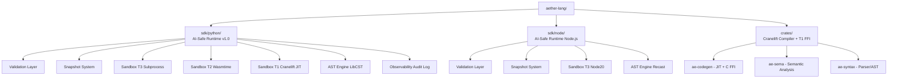
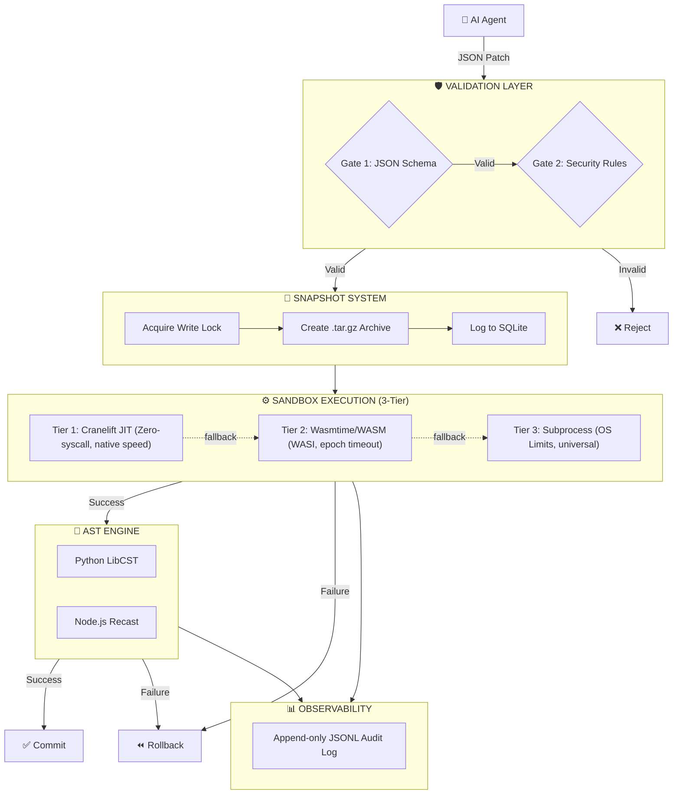

# Aether → AI-Safe Execution Infrastructure

> **This repository has evolved from a Cranelift-based systems language compiler into an AI-Safe Execution Infrastructure — a structured, sandboxed, and reversible runtime for AI-driven code modification.**

---

## What is this?

AI coding agents (LLMs, Copilots, AutoGPT, etc.) currently modify codebases by generating raw text diffs or source code and applying them directly. This is fundamentally unsafe:

- No schema — the change is freeform text with no verifiable structure
- No isolation — the change executes in the live process with full filesystem access
- No rollback — recovery depends on `git reset` or manual intervention
- No contract — ambiguity about what the agent intended vs. what it wrote

**AI-Safe Execution Infrastructure** fixes this by treating AI code modification as a **controlled state transition problem** rather than a text generation problem.

```
❌ Before:  AI agent ──(raw diff)──▶ git apply ──▶ hope it works

✅ After:   AI agent ──(Patch JSON)──▶ Validate ──▶ Snapshot ──▶ Sandbox ──▶ Commit/Rollback
```

---

## Repository Layout



```
aether-lang/
│
├── sdk/python/                  ← AI-Safe Runtime (Python SDK, v1.0)
│   ├── ai_runtime/
│   │   ├── patch_engine.py      ← PatchEngine: validate() + apply() orchestrator
│   │   ├── sandbox.py           ← Sandbox: T1/T2/T3 tier dispatcher
│   │   ├── sandbox_t1.py        ← T1: Cranelift JIT via ctypes FFI
│   │   ├── sandbox_t2.py        ← T2: Wasmtime/WASI WASM sandbox
│   │   ├── sandbox_t3.py        ← T3: subprocess + OS resource limits
│   │   ├── sandbox_runner.py    ← Worker script (runs inside child process)
│   │   ├── _types.py            ← Shared dataclasses
│   │   ├── validation/
│   │   │   ├── patch_schema.json  ← JSON Schema Draft 2020-12 contract
│   │   │   ├── schema.py          ← Gate 1: schema validation
│   │   │   └── rules.py           ← Gate 2: security allow-list
│   │   ├── snapshot/
│   │   │   ├── store.py           ← SnapshotStore: capture/restore/commit/prune
│   │   │   ├── gitignore.py       ← .gitignore-aware file collector
│   │   │   └── lock.py            ← Cross-platform write lock
│   │   ├── ast/                   ← AST Apply Engine (LibCST)
│   │   └── observability/         ← Audit log, diff, events
│   └── tests/                   ← 165 tests (all passing)
│
├── sdk/node/                    ← AI-Safe Runtime (Node.js SDK)
│   ├── src/
│   │   ├── validation/          ← Ajv JSON Schema + security rules
│   │   ├── snapshot/            ← tar.gz snapshots
│   │   ├── sandbox/
│   │   │   ├── ae_sandbox_napi.cpp  ← N-API C++ wrapper for Rust FFI
│   │   │   └── sandbox.js           ← T3 subprocess sandbox
│   │   └── ast/                 ← Recast AST engine (JS/TS)
│   └── binding.gyp              ← node-gyp build config for T1 N-API addon
│
├── crates/                      ← Aether language compiler (Rust/Cranelift)
│   ├── ae/                      ← CLI binary (ae run, ae build)
│   ├── ae-codegen/
│   │   ├── src/
│   │   │   ├── lib.rs           ← Tree-walking interpreter (T1 fast path)
│   │   │   ├── jit.rs           ← Cranelift JIT compiler
│   │   │   └── ffi.rs           ← C-ABI guard ring (ae_sandbox_execute/free)
│   │   └── Cargo.toml           ← cdylib + rlib dual output
│   ├── ae-sema/                 ← Semantic analysis
│   └── ae-syntax/               ← Parser / AST
│
└── architecture doc/
    └── AI-Safe-Execution-Infrastructure-Documentation.md
```

---

## System Architecture



---

## Python SDK — Quick Start

```bash
pip install ai-safe-runtime
```

```python
import uuid
from ai_runtime import PatchEngine, Sandbox

# 1. Build a structured patch
patch = {
    "schema_version": "1.0",
    "patch_id": str(uuid.uuid4()),
    "action": "modify_function",
    "target": {
        "file": "src/app.py",
        "symbol": "calculate_total",
        "symbol_type": "function",
    },
    "changes": {
        "operation": "replace_body",
        "payload": "    return sum(items)",
    },
}

# 2. Validate — two-gate, < 1ms
engine = PatchEngine()
report = engine.validate(patch)

if report.ok:
    # 3. Snapshot — capture project state
    sb     = Sandbox(project_root=".")
    handle = sb.snapshot(patch_id=patch["patch_id"])

    # 4. Apply + check execution result
    result = engine.apply(patch)

    if result and result.failed:
        sb.restore(handle)           # 5a. Rollback on failure
    else:
        sb.commit_snapshot(handle)   # 5b. Commit on success
else:
    print(f"Rejected: {report.first_error}")
```

### Tier Selection

```python
# Explicit tier selection
from ai_runtime import Sandbox

sb = Sandbox(preferred_tier="t1_cranelift")  # Fastest — Cranelift JIT native
sb = Sandbox(preferred_tier="t2_wasm")       # Isolated — Wasmtime WASI sandbox
sb = Sandbox(preferred_tier="t3_subprocess") # Universal — OS-level subprocess
```

**Full SDK documentation:** [`sdk/python/README.md`](sdk/python/README.md)

---

## Patch Schema Reference

All patches must conform to the JSON Schema at [`sdk/python/ai_runtime/validation/patch_schema.json`](sdk/python/ai_runtime/validation/patch_schema.json).

| Field | Required | Description |
|:------|:---------|:------------|
| `schema_version` | ✅ | `"1.0"` |
| `patch_id` | ✅ | UUID v4 — for idempotency and audit |
| `action` | ✅ | One of 7 supported actions |
| `target.file` | ✅ | Relative path — no `/` prefix, no `..` |
| `changes.operation` | ✅ | Must be in allow-list for the action |
| `changes.payload` | ✅ | Source code, max 64 KB |
| `constraints.timeout_ms` | ○ | 100 – 30000 ms |
| `constraints.memory_limit_mb` | ○ | Memory cap for sandbox |
| `metadata.*` | ○ | Agent provenance, model, confidence |

---

## Phase 8: T1 Cranelift JIT FFI Integration

Phase 8 bridges the Rust Cranelift compiler into the Python/Node SDKs via a **panic-safe C-ABI guard ring**.

### Architecture

```
[Python / Node.js SDK]
         │
         │  ctypes / N-API
         ▼
┌─────────────────────────────────────┐
│  Panic-Safe ABI Guard Ring          │
│  extern "C" ae_sandbox_execute()    │  ← std::panic::catch_unwind
│  extern "C" ae_sandbox_free()       │  ← deterministic heap dealloc
└─────────────────────────────────────┘
         │
         ▼
  [ae-syntax::parse]  →  [ae-sema::analyze]  →  [Interpreter::run]
                                                      ↑
                                              (JIT via cranelift-jit)
```

### Build

```bash
# Compile the Rust shared library
cargo build --release -p ae-codegen

# The output is:
# Windows: target/release/ae_codegen.dll
# Linux:   target/release/libae_codegen.so
# macOS:   target/release/libae_codegen.dylib
```

### Python Usage

```python
from ai_runtime.sandbox_t1 import T1CraneliftSandbox

# Library is auto-discovered from target/release/ or AE_CODEGEN_LIB env var
sb = T1CraneliftSandbox()
result = sb.run("let x = 1 + 2;")
print(result.success, result.elapsed_ms)
# True  0.12
```

### Node.js Usage

```javascript
// After building with node-gyp
const { aeLoadLibrary, aeSandboxExecute } = require('./build/Release/ae_sandbox_napi');
aeLoadLibrary('ae_codegen.dll');  // or libae_codegen.so

const { _raw } = aeSandboxExecute('let x = 1 + 2;');
const result = JSON.parse(_raw);
console.log(result.success, result.elapsed_ms);
```

### Safety Contract

| Property | Implementation |
|:---------|:---------------|
| **No Rust panics cross FFI boundary** | `std::panic::catch_unwind` wraps all execution |
| **No memory leaks** | `ae_sandbox_free` reclaims every `ae_sandbox_execute` result |
| **NULL safety** | NULL input returns JSON error; NULL free is a no-op |
| **Deterministic dealloc** | Python uses `c_void_p` + explicit free in `finally` block |

---

## T2 Sandbox: Wasmtime/WASI

Phase 7 implemented epoch-based timeout control (not instruction-fuel) for accurate wall-clock enforcement:

```python
from ai_runtime.sandbox_t2 import T2WasmSandbox

sb = T2WasmSandbox()
result = sb.run(python_script, timeout_ms=5000)
```

- **Epoch ticking** via background thread — accurate wall-clock timeouts
- **WASI exit code detection** — `sys.exit(N)` maps correctly to `exit_code`
- **`python.wasm`** fetched lazily and cached in `.ai_runtime/cache/`

---

## Why Cranelift?

The original goal of this repo was to build **Aether** — a compiled systems language using Cranelift as the backend. That work proved that:

1. Cranelift can be embedded in Rust and driven purely from safe Rust code
2. JIT compilation via `cranelift-jit` produces native code with zero syscall overhead
3. The `JITModule` and `ObjectModule` share the same `Module` trait — one lowering pass serves both JIT and AOT

These properties make `crates/ae-codegen` the ideal **T1 sandbox backend** — a Cranelift JIT that executes AI-generated Aether code with no syscall surface, accessible from the Python SDK via a stable C-ABI FFI.

---

## Test Suite

```bash
# Rust tests (FFI guard ring + JIT)
cargo test -p ae-codegen

# Python tests
cd sdk/python
pip install -e ".[dev]"
pytest tests/ -v
```

### Rust (ae-codegen)

```
running 6 tests
test ffi::tests::ffi_free_null_is_noop         ... ok
test ffi::tests::ffi_null_pointer_returns_error ... ok
test ffi::tests::ffi_parse_error_returns_failure ... ok
test ffi::tests::ffi_valid_source_returns_success ... ok
test jit::tests::test_jit_basic_math           ... ok
test jit::tests::test_jit_let_and_if           ... ok

test result: ok. 6 passed; 0 failed
```

### Python SDK

```
165 tests collected
├── test_validation.py         34 tests  (Phase 1: Validation Layer)
├── test_sandbox.py            26 tests  (Phase 2: Sandbox T3)
├── test_sandbox_t3_windows.py  3 tests  (Phase 2: Windows Job Objects)
├── test_snapshot.py           31 tests  (Phase 3: Snapshot System)
├── test_observability.py       8 tests  (Phase 4: Audit Log)
├── test_ast_engine.py          7 tests  (Phase 5: LibCST AST Engine)
├── test_sandbox_t2.py          5 tests  (Phase 7: Wasmtime WASI)
└── test_ffi_fuzz.py           51 tests  (Phase 8: T1 FFI Fuzz Suite)
```

---

## Roadmap

| Phase | Component | Status |
|:------|:----------|:-------|
| 1 | Validation Layer (JSON Schema + Rules) | ✅ Complete |
| 2 | T3 Sandbox (subprocess + OS limits) | ✅ Complete |
| 3 | Snapshot System (tar.gz + SQLite + locks) | ✅ Complete |
| 4 | Observability (audit log, diffs, CLI status) | ✅ Complete |
| 5 | AST Apply Engine (`modify_function` via LibCST) | ✅ Complete |
| 6 | Node.js SDK (`sdk/node/`) | ✅ Complete |
| 7 | T2 Sandbox (Wasmtime/WASI + epoch timeout) | ✅ Complete |
| 8 | T1 Sandbox (Cranelift JIT C-ABI FFI) | ✅ Complete |
| 8.5 | Node.js T1 N-API addon (`ae_sandbox_napi.cpp`) | ✅ Scaffolded |

---

## Requirements

- **Python SDK**: Python ≥ 3.11, no Docker, no root
- **Rust compiler**: Required to build `crates/ae-codegen` for T1 (`rustup target add x86_64-pc-windows-msvc`)
- **Platforms**: Windows 10+, Linux, macOS

---

## License

MIT
