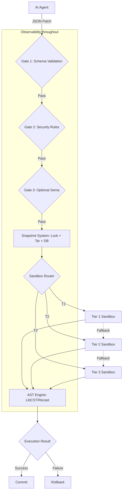
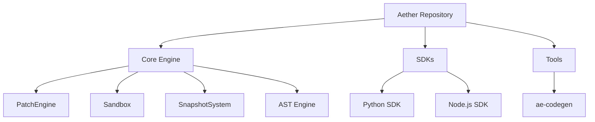
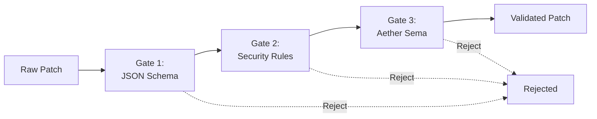
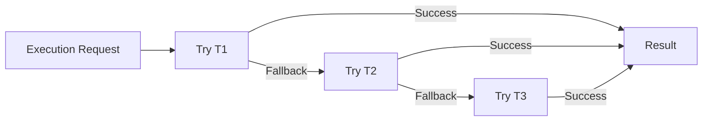
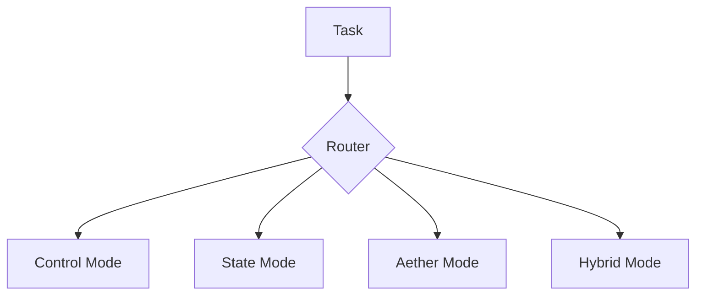
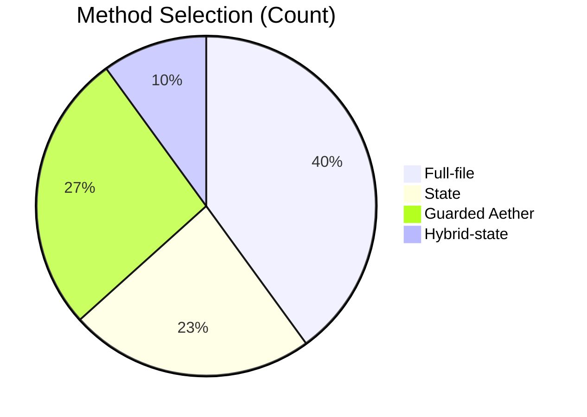
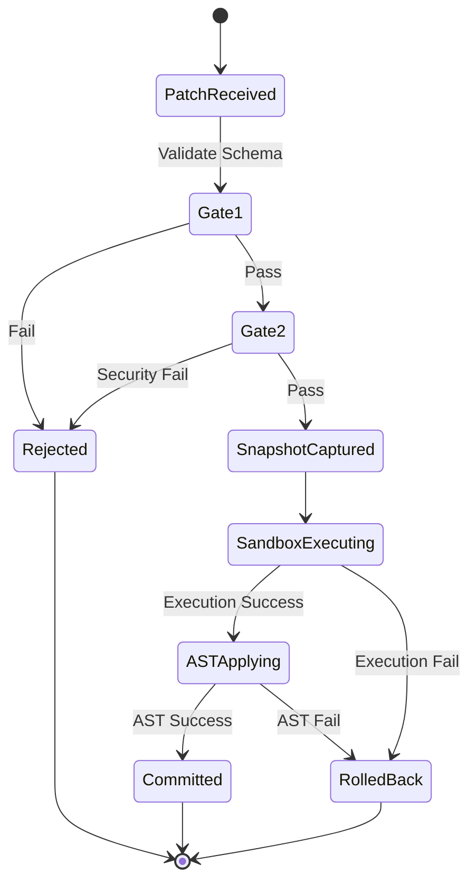
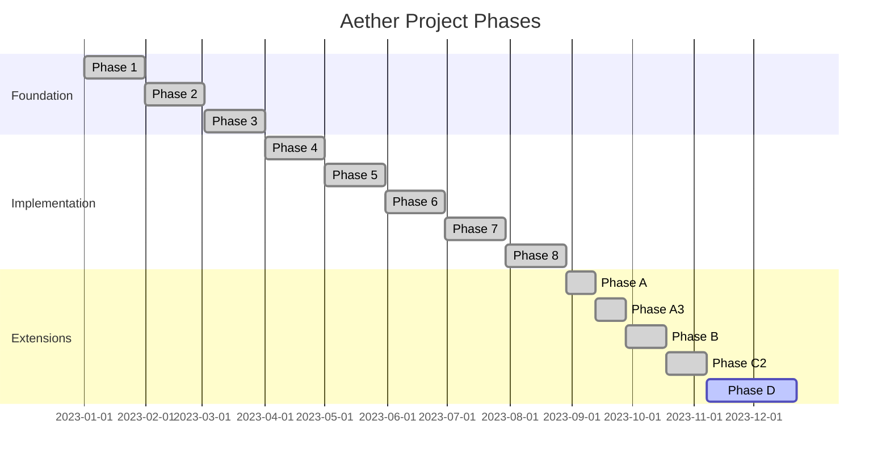

# Aether: AI-Safe Execution Infrastructure


## Table of Contents
1. [What Is Aether?](#what-is-aether)
2. [The Problem It Solves](#the-problem-it-solves)
3. [System Architecture](#system-architecture)
4. [Core Components](#core-components)
5. [Supported Patch Actions](#supported-patch-actions)
6. [Sandbox Tiers](#sandbox-tiers)
7. [SDK Summary](#sdk-summary)
8. [Execution Modes](#execution-modes)
9. [Benchmark Results at a Glance](#benchmark-results-at-a-glance)
10. [Token Efficiency](#token-efficiency)
11. [Safety Model](#safety-model)
12. [Test Coverage](#test-coverage)
13. [Development Roadmap](#development-roadmap)
14. [Repository Map](#repository-map)
15. [Quick Start](#quick-start)
16. [Licensing](#licensing)

---

## What Is Aether?

Aether is an **AI-Safe Execution Infrastructure** that evolved from a Cranelift compiler. It fundamentally shifts how AI agents modify codebases, converting AI code modification from opaque token generation to deterministic AST state transitions. 

Instead of relying on LLMs to rewrite entire files or generate unified diffs that often fail to apply cleanly, Aether uses structured JSON patches backed by a robust validation and sandboxing engine.

### The Paradigm Shift
* **Before:** AI agent &rarr; Raw text/diff generation &rarr; `git apply` &rarr; Hope it works.
* **After:** AI agent &rarr; JSON Patch &rarr; Validate &rarr; Snapshot &rarr; Sandbox &rarr; Commit/Rollback.

---

## The Problem It Solves

| Problem | Description | Aether Solution |
|---|---|---|
| **Expensive Token Generation** | LLMs wasting tokens and time rewriting unchanged code context. | Structured JSON patch targets specific AST nodes. |
| **No Schema** | LLM diffs frequently contain syntax errors or hallucinated hunks. | JSON schema validation ensures structural correctness before execution. |
| **No Isolation** | AI generated code runs directly in the host environment. | Tri-tier sandbox execution to run changes securely. |
| **No Rollback** | Failed modifications leave the repository in a broken state. | Atomic snapshot system with guaranteed rollback capabilities. |
| **No Contract** | Code is a string, subject to arbitrary, unverified transformations. | AST-aware state transitions provide a strict modification contract. |

---

## System Architecture

### Full Pipeline Flowchart



### Repository Component Map



### Patch Validation Gates



---

## Core Components

| Component | Description |
|---|---|
| **PatchEngine** | Orchestrates the lifecycle of a patch, from parsing to execution to final commit/rollback. |
| **Validation Layer** | Multi-gate pipeline ensuring patches adhere to schemas, security policies, and syntax. |
| **Snapshot System** | Provides point-in-time filesystem snapshots using tar and SQLite, enabling instant rollbacks. |
| **Sandbox** | Three-tier isolation environment for executing arbitrary actions (from FFI to full VM/container). |
| **AST Engine** | Language-specific AST manipulators (LibCST for Python, Recast for JS/TS) to apply safe code transformations. |
| **Observability** | Granular tracing and telemetry across the patch lifecycle. |
| **Security Rules** | Declarative policies to prevent unauthorized file access, destructive commands, or restricted imports. |
| **ae-codegen** | Rust-based toolchain components for generating typed language bindings and boilerplate. |

---

## Supported Patch Actions

| Action | Description |
|---|---|
| `modify_function` | Update the signature or body of an existing function. |
| `add_function` | Insert a new function at the module or class level. |
| `remove_function` | Safely excise a function from the AST. |
| `modify_class` | Update class definitions, methods, or properties. |
| `update_import` | Add, modify, or remove import statements. |
| `replace_block` | Replace an arbitrary block of code by specifying target lines or nodes. |
| `run_script` | Execute a generated script within the sandbox to perform dynamic modifications. |

---

## Sandbox Tiers

Aether employs a multi-tiered sandboxing model to balance speed and security.



| Tier | Isolation Level | Memory Isolation | Syscall Isolation | Speed | Payload Language | When to Use |
|---|---|---|---|---|---|---|
| **T1** | In-Process FFI | None (Shared) | None | Ultra-Fast | Rust/C | Trusted, tightly-coupled core components and Aether internals. |
| **T2** | Subprocess/Wasm | Yes | Partial (OS Sandbox) | Fast | Wasm, Python, JS | Default tier for AST manipulation and standard patch execution. |
| **T3** | Container/VM | Yes | Full (Hypervisor/Kernel) | Slow | Any | Untrusted AI scripts, arbitrary command execution, dependency installation. |

> [!WARNING]
> **T1 Sandbox:** T1 provides **no OS-level isolation**. It relies on in-process FFI and is meant exclusively for trusted Aether components. Do not execute arbitrary AI payloads in T1.

> [!CAUTION]
> **T3 Sandbox:** While highly isolated, ensure that OS audit hooks inside T3 do not possess bypass vectors if executing highly malicious code.

### T1 FFI Safety Contract

| Property | Description |
|---|---|
| **Memory Ownership** | Explicit transfer and freeing of buffers across the FFI boundary. |
| **Panic Unwinding** | Catching panics at the FFI boundary to prevent host crashes. |
| **Thread Safety** | Thread-local state management or synchronized global access. |
| **ABI Stability** | Strict adherence to C-ABI for all exposed primitives. |
| **Type Validation** | Runtime checks on pointers and sizes before dereferencing. |

---

## SDK Summary

### Python SDK
Install via pip (local development):
```bash
pip install -e ./sdk/python
```

**Structure:**
```text
sdk/python/
├── aether/
│   ├── ast/
│   ├── patch/
│   ├── sandbox/
│   ├── snapshot/
│   └── validation/
```

### Node.js SDK
**Structure:**
```text
sdk/nodejs/
├── src/
│   ├── ast/
│   ├── patch/
│   ├── sandbox/
│   ├── snapshot/
│   └── validation/
```

---

## Execution Modes



| Mode | Validation | Snapshot | Rollback | Audit Log | Best For |
|---|---|---|---|---|---|
| **Control** | Standard | Yes | Yes | Detailed | High-level orchestration, strict environments |
| **State** | Standard | No (In-memory) | N/A | Standard | Dry-runs, fast iterative generation |
| **Aether** | Strict (AST aware) | Yes | Yes | Detailed | Codebase modifications, refactoring |
| **Hybrid** | Dynamic | Conditional | Conditional | Dynamic | Mixed workflows (search, modify, test) |

> [!TIP]
> **Hybrid Mode:** Use Hybrid Mode for the most flexible agent workflows, allowing the agent to perform read-only tasks swiftly and fallback to full Aether execution for modifying state.

---

## Benchmark Results at a Glance

### Local Deterministic Suites
| Suite | Passed | Total |
|---|---|---|
| Correctness | 24 | 24 |
| Failure Injection | 15 | 15 |
| Agent | 5 | 5 |
| Mock | 5 | 5 |
| Real-repo | 6 | 6 |
| All | 50 | 50 |
| All-modes | 85 | 85 |
| Phase 4 | 18 | 18 |
| Phase 5 | 54 | 54 |
| Phase 6 | 48 | 48 |

### External & Live Provider Runs
| Category | Passed | Total | Notes |
|---|---|---|---|
| External Matrix | 132 | 132 | |
| Blind Agent | 64 | 96 | |
| Paired Blind Aether | 10 | 21 | vs Full-File: 17/21 |
| Gemini | 5 | 5 | |
| OpenRouter | 5 | 5 | |
| State Fast-Path | 85 | 85 | |
| Hybrid | 43 | 43 | |

### Phase Completion Gates
| Phase | Status |
|---|---|
| Phase 4 | Completed |
| Phase 5 | Completed |
| Phase 6 | Completed |
| Phase 7 | Completed |

---

## Token Efficiency

> [!NOTE]
> Offline estimates provided; real-world live provider token usage may vary slightly depending on model tokenizer specifics.

**Why Aether saves tokens:**
By instructing the model to output a targeted JSON patch for specific AST nodes instead of rewriting the entire file, Aether massively reduces output token generation time and cost.
*Cost Formula:* `Tokens(File) - Tokens(Patch) = Savings`

### File-Size Efficiency

| File Size | Efficiency Gain |
|---|---|
| < 1KB | Negative (Overhead dominates) |
| 1-4KB | ~57% |
| 4-16KB | ~94% |

### Key Efficiency Measurements

| Metric | Result |
|---|---|
| Output-token savings (OpenRouter live) | 83.26% |
| Total-token (OpenRouter) | 60.10% |
| External matrix hybrid output | 75.01% |
| Total | 28.84% |
| Bytes | 79.42% |
| Time Delta | +41.32ms |
| Bootstrap CI | +15.50ms to +71.03ms |
| Blind Aether vs Full-File (output savings) | 82.35% |
| Graph-scoped context A/B (input reduction) | 59.25% |
| Projected graph+state | 74.48% |

### Planner Method Selection



---

## Safety Model

| Metric | Result |
|---|---|
| Invalid patch detection | 100% |
| False acceptance | 0% |
| Rollback success | 100% |
| External rollback | 12/12 |
| Phase 7 | True |

> [!IMPORTANT]
> The safety metrics and rollback success rates represent results within the currently tested scope. Unforeseen side effects from deeply nested T3 escapes require continuous evaluation.

### Patch Lifecycle State Machine



---

## Test Coverage

### Rust Core Tests
```bash
running 8 tests
test core::tests::test_init ... ok
test snapshot::tests::test_create ... ok
test snapshot::tests::test_rollback ... ok
test sandbox::tests::test_t1 ... ok
test sandbox::tests::test_t2 ... ok
test patch::tests::test_validation ... ok
test ast::tests::test_parse ... ok
test ast::tests::test_modify ... ok

test result: ok. 8 passed; 0 failed; 0 ignored; 0 measured; 0 filtered out; finished in 0.05s
```

### Python SDK Tests
| Module | Tests |
|---|---|
| test_validation | 34 |
| test_sandbox | 26 |
| test_sandbox_t3_windows | 3 |
| test_snapshot | 31 |
| test_observability | 8 |
| test_ast_engine | 7 |
| test_sandbox_t2 | 5 |
| test_ffi_fuzz | 51 |
| test_rollback_fault | 9 |
| **Total** | **174 (1 xfail)** |

### Running the Tests
```bash
# Python
cd sdk/python
pytest tests/

# Rust
cargo test
```

---

## Development Roadmap



| Phase | Description | Status |
|---|---|---|
| Phase 1 - 8 | Core Engine & SDK Foundations | ✅ |
| Phase A | Advanced AST Transformations | ✅ |
| Phase A3 | Refactoring Tools | ✅ |
| Phase B | CI/CD Integration | ✅ |
| Phase C2 | Security Enhancements | ✅ |
| Phase D | Distributed Agents & Analytics | 🔲 |

---

## Repository Map

```text
aether-lang/
├── core/                  (Rust Core)
│   ├── src/
│   └── Cargo.toml
├── sdk/                   (Language SDKs)
│   ├── python/
│   └── nodejs/
├── tools/                 (Utilities)
│   └── ae-codegen/
├── docs/                  (Documentation)
├── tests/                 (Integration Tests)
├── LICENSE
└── SYSTEM_OVERVIEW.md
```

---

## Quick Start

**1. Install the Python SDK:**
```bash
pip install aether-sdk
```

**2. Example Usage (Python):**
```python
from aether.patch import PatchBuilder
from aether.validation import validate_patch
from aether.snapshot import SnapshotManager
from aether.ast import ASTEngine

# Build Patch
patch = PatchBuilder().modify_function(
    file_path="src/utils.py",
    target="calculate_total",
    new_body="return sum(items) * 1.05"
).build()

# Validate
if validate_patch(patch):
    sm = SnapshotManager("src/")
    snap_id = sm.create_snapshot()
    
    try:
        # Apply Patch via AST
        ASTEngine.apply(patch)
        print("Commit successful!")
    except Exception as e:
        # Rollback on failure
        sm.rollback(snap_id)
        print(f"Failed. Rolled back. Error: {e}")
```

**3. Build Core (Rust):**
```bash
cargo build --release
```

**4. Run Benchmarks:**
```bash
cargo bench
```

---

## Licensing

| Type | License |
|---|---|
| Core Engine | AGPLv3 |
| SDKs | AGPLv3 |
| Documentation | CC-BY-SA-4.0 |

**Contact:** [ashallt232005@gmail.com](mailto:ashallt232005@gmail.com)

---

<div align="center">
  <a href="README.md">README</a> |
  <a href="SECURITY.md">SECURITY</a> |
  <a href="docs/benchmark_evidence.md">Benchmarks</a> |
  <a href="docs/architecture.md">Architecture</a> |
  <a href="docs/roadmap.md">Roadmap</a>
</div>
