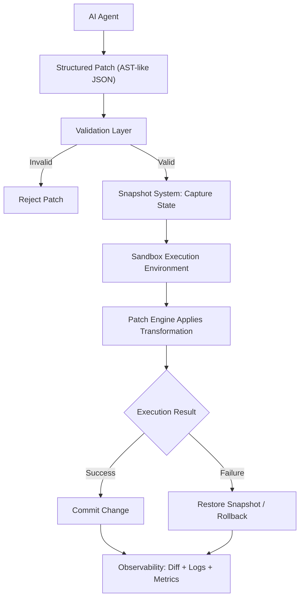
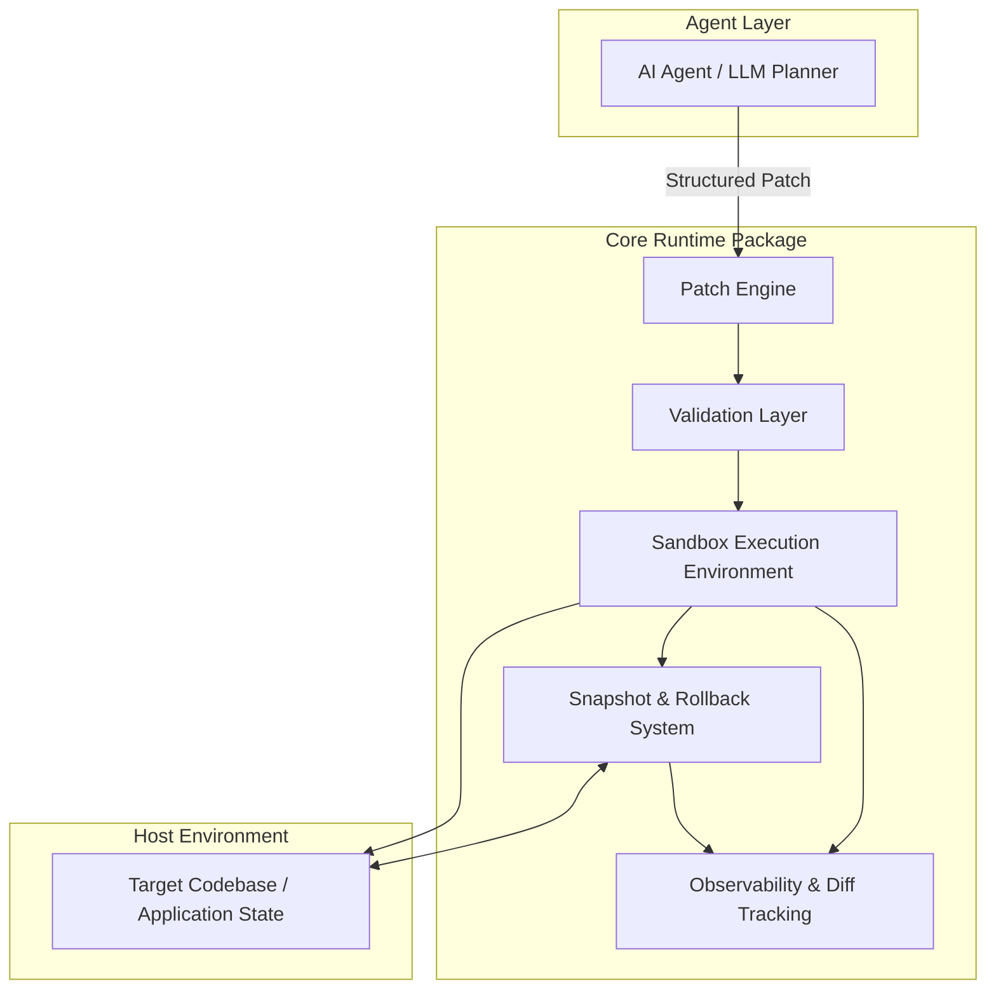
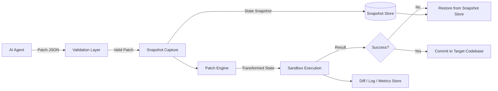
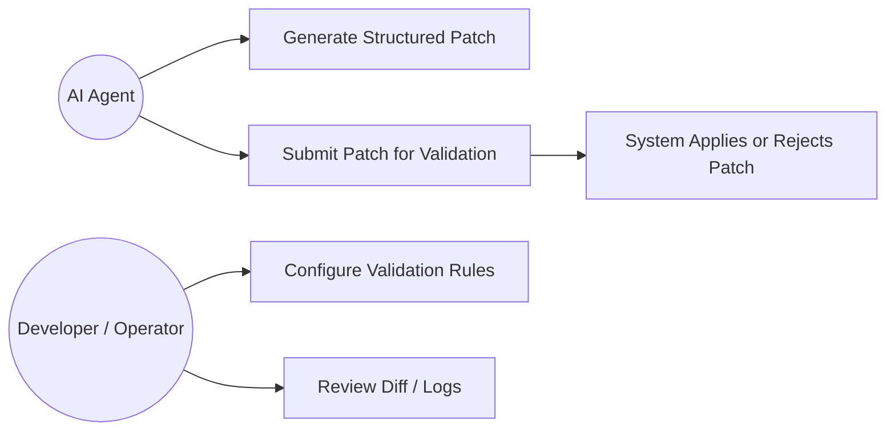
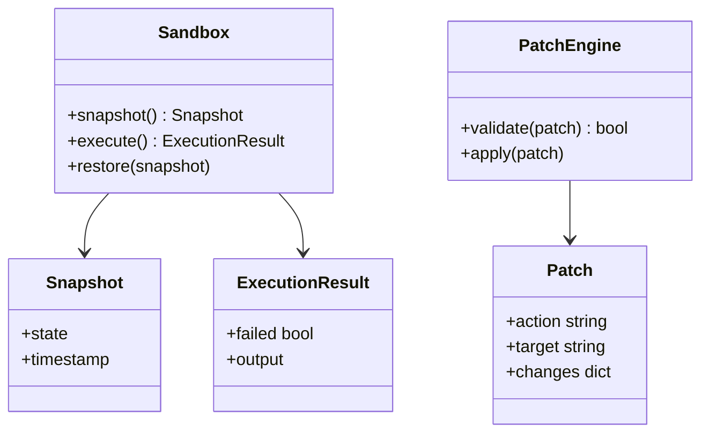
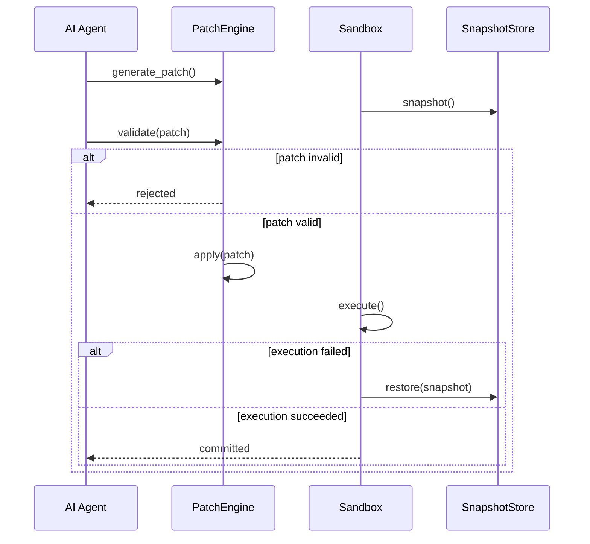
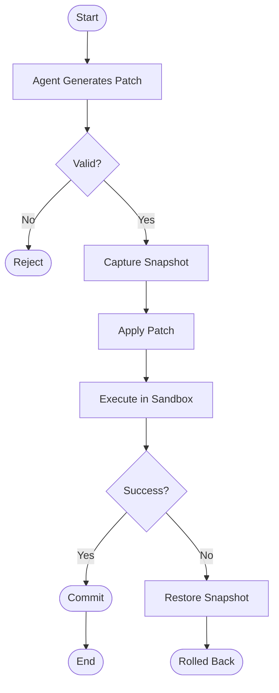
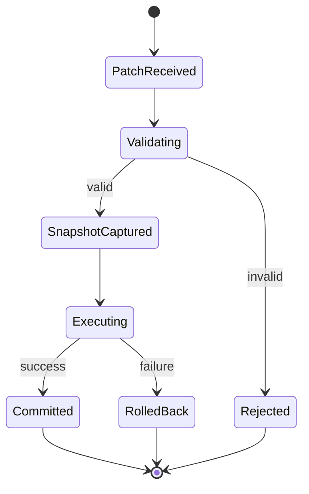
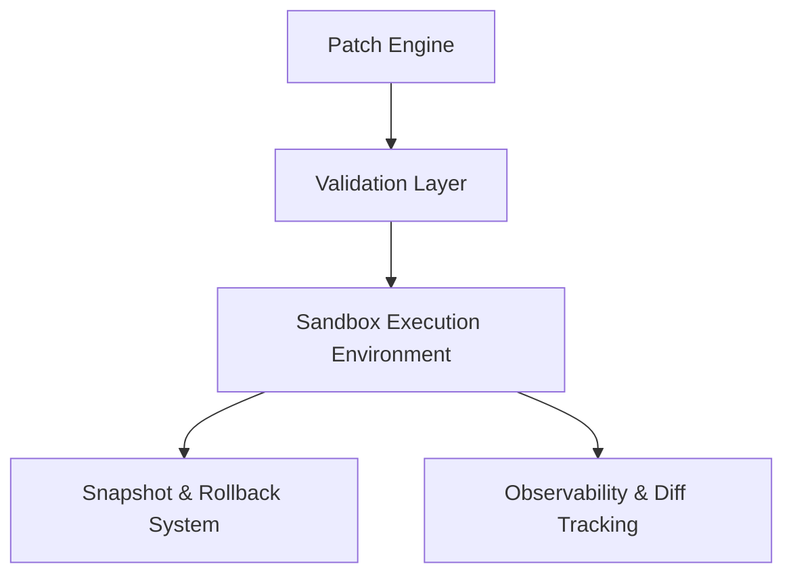
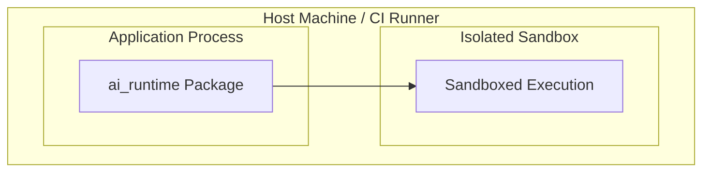

# AI-Safe Execution Infrastructure for Autonomous Code Modification

<div align="center">
  
  
  
</div>

> [!NOTE]
> **Status:** Draft — derived strictly from the source concept report. Sections requiring information not present in the source are explicitly marked `[GAP]` with a recommendation.

---

## 1. Executive Summary

### 1.1 Project Overview

The project proposes a language-agnostic runtime infrastructure that allows AI agents to modify existing software safely. Instead of AI agents generating and directly executing human-readable source code (Python, JavaScript, etc.), the system requires agents to emit structured, AST-like patch instructions that pass through a validation layer, run inside an isolated sandbox, and are committed or rolled back based on a snapshot mechanism.

### 1.2 Purpose

To provide a reusable package/library layer (not a new programming language) that any Python or Node.js project can integrate, giving AI coding agents a safe, reversible, and auditable way to change running or existing codebases.

### 1.3 Background

As AI agents increasingly generate and apply code changes autonomously (in IDEs, CI pipelines, self-healing systems, etc.), the dominant pattern today is: agent generates raw code → code is executed or committed directly. This pattern lacks structural guarantees.

### 1.4 Problem Statement

Current AI-driven code modification approaches suffer from:

- **Syntax Fragility:** Generated code may not compile/run.
- **Uncontrolled Execution:** Changes can be applied directly against live system state.
- **Lack of Validation:** No structured pre-execution correctness check.
- **Irreversibility:** No dependable rollback path.
- **Difficult Debugging:** Raw text diffs obscure the agent's intent.

### 1.5 Motivation

A structured, sandboxed, snapshot-backed execution layer converts AI code modification from an unpredictable text-generation problem into a controlled, verifiable state-transition problem — improving reliability enough for realworld, production-adjacent use.

## 2. Project Objectives

### 2.1 Primary Objectives

- Replace raw AI-generated code execution with structured AST-like patches.
- Guarantee safe execution via process/container sandboxing.
- Guarantee recoverability via pre-modification snapshots and rollback.
- Provide a validation layer that rejects malformed, disallowed, or unsafe patches before execution.
- Ship as an installable package, not a new language or platform.

### 2.2 Secondary Objectives

- Provide observability: structured diffs, execution logs, performance metrics for every AI-driven change.
- Support at least two ecosystems at launch: Python (primary) and Node.js (secondary).
- Keep the integration surface small enough for adoption inside existing codebases with minimal refactoring.

### 2.3 Success Criteria

| Criterion | Target (recommended) |
| --- | --- |
| **Patch validation** | Catches 100% of schema-invalid patches; malformed/unsafe patches rejected pre-execution |
| **Rollback reliability** | 100% successful restoration to pre-patch snapshot on failure |
| **Sandboxed execution containment** | 0 modifications observed outside sandbox boundary in testing |
| **Language coverage at v1** | Python fully supported, Node.js supported for core operations |
| **Adoption friction** | Integrable into an existing project in < 30 minutes (per quickstart) |

> [!TIP]
> `[GAP]` The source report does not define numeric success thresholds (e.g., latency budgets, patch throughput). Values above are recommended placeholders for the team to calibrate.

## 3. Scope of Work

### 3.1 In Scope

- AST-based structured patch schema and patch engine.
- Sandboxed execution environment (process/container isolation, resource limits).
- Snapshot capture and rollback subsystem.
- Rule-based validation layer (structural, security, logical checks).
- Observability layer: diff tracking, execution logs, performance metrics.
- Python SDK (primary), Node.js SDK (secondary).

### 3.2 Out of Scope (for initial version)

- Support for languages beyond Python and Node.js.
- A visual/GUI debugger for AST transformations (listed as future work in the source).
- Distributed/multi-node sandbox execution (listed as future work).
- LLM-based planning or patch-generation logic itself — the system consumes patches; it does not generate them.

### 3.3 Assumptions

- The AI agent producing patches is a separate, external component (e.g., an LLM-based planner) that emits patches conforming to the system's schema. `[GAP: schema is not fully specified in source — see §12]`
- The host environment can run sandboxed/isolated processes (e.g., via containers or OS-level isolation).
- Target codebases are primarily Python or Node.js projects.

### 3.4 Constraints

- Must remain a library/package, not a standalone language or execution platform, per the source's explicit design decision.
- Must not require rewriting the host application; integration is additive.
- Sandbox execution introduces performance overhead (acknowledged limitation in source, §9).

### 3.5 System Boundaries

The system's boundary starts at patch ingestion (from an AI agent) and ends at commit or rollback of the target codebase's state. It does not own or control the AI agent's decision-making, prompt engineering, or model selection.

## 4. Functional Requirements

| ID | Requirement |
| :--- | :--- |
| **FR-001** | The system SHALL accept structured, AST-like JSON patches as the sole input format for AI-driven modifications. |
| **FR-002** | The system SHALL reject any patch that does not conform to the defined patch schema. |
| **FR-003** | The system SHALL validate structural correctness of a patch before execution. |
| **FR-004** | The system SHALL enforce an allow-list of permitted operations (e.g., `modify_function`, `update_logic`) and reject disallowed operations. |
| **FR-005** | The system SHALL perform security constraint checks on incoming patches prior to execution. |
| **FR-006** | The system SHALL perform logical consistency checks (e.g., target exists, change is applicable) before execution. |
| **FR-007** | The system SHALL capture a snapshot of the current state before applying any modification. |
| **FR-008** | The system SHALL apply validated patches only within an isolated sandbox execution environment. |
| **FR-009** | The system SHALL enforce resource constraints (CPU, memory) on sandboxed execution. |
| **FR-010** | The system SHALL restrict sandboxed processes' system access. |
| **FR-011** | The system SHALL evaluate execution results and determine commit vs. rollback. |
| **FR-012** | The system SHALL restore the pre-modification snapshot automatically when execution fails or validation fails post-hoc. |
| **FR-013** | The system SHALL record a structured (AST-level) diff for every applied change. |
| **FR-014** | The system SHALL log execution details and performance metrics for every patch lifecycle (received → validated → executed → committed/rolled back). |
| **FR-015** | The system SHALL expose a Python API (`Sandbox`, `PatchEngine`, `snapshot()`, `validate()`, `apply()`, `execute()`, `restore()`) as shown in the source implementation example. |
| **FR-016** | The system SHALL expose equivalent functionality for Node.js as a secondary supported environment. |

## 5. Non-Functional Requirements

| Category | Requirement |
| :--- | :--- |
| **Performance** | Sandbox overhead should be minimized; system should log per-patch latency so overhead is measurable. `[GAP: no target latency given in source]` |
| **Scalability** | Architecture should not preclude future distributed sandbox execution (explicitly named as future work). |
| **Reliability** | Snapshot/rollback must guarantee recoverability to a known-good state after any failed modification. |
| **Security** | Sandbox must enforce process/container isolation and restricted system access; validation layer must enforce security constraints pre-execution. |
| **Maintainability** | Patch schema and validation rules should be versionable and independently updatable from the sandbox/execution engine. |
| **Availability** | `[GAP]` Not addressed in source—recommend defining uptime expectations if deployed as a persistent service rather than an embedded library. |
| **Usability** | Integration should require minimal code (source shows a ~10-line Python integration example). |
| **Portability** | Must function as an installable package across Python and Node.js ecosystems without requiring a custom language runtime. |

## 6. End-to-End Workflow

1. An external AI agent generates a structured patch (AST-like JSON) describing an intended code change.
2. The patch is submitted to the Validation Layer.
3. The Validation Layer checks structural correctness, allowed operations, security constraints, and logical consistency.
4. If validation fails → patch is rejected, no state change occurs.
5. If validation succeeds → the Snapshot System captures the current state.
6. The Patch Engine applies the transformation within the Sandbox Execution Layer.
7. The sandboxed result is evaluated.
8. If execution succeeds and passes checks → the change is committed.
9. If execution fails → the system restores the previous snapshot (rollback).
10. All steps are recorded via Observability & Diff Tracking (structured diffs, logs, metrics).



## 7. System Architecture

### 7.1 Components

| Component | Responsibilities | Inputs | Outputs | Dependencies |
| :--- | :--- | :--- | :--- | :--- |
| **Patch Engine** | Parses, applies AST-like structured patches | Structured patch (JSON) | Applied transformation | Validation Layer |
| **Validation Layer** | Structural, security, and logical checks | Raw patch | Accept/Reject decision | Patch schema definitions |
| **Sandbox Execution Environment** | Isolated, resource-constrained execution | Validated patch + target codebase | Execution result | OS/container isolation primitives |
| **Snapshot & Rollback System** | Captures pre-change state, restores on failure | Codebase state | Snapshot object / restored state | Sandbox Execution Environment |
| **Observability & Diff Tracking** | Structured diffs, logs, performance metrics | Execution results | Diff records, logs, metrics | All components above |

### 7.2 Architecture Diagram



## 8. Module Breakdown

### 8.1 Patch Engine

- **Purpose:** Translate structured patch objects into concrete transformations on target code.
- **Responsibilities:** Parse patch JSON; resolve target (e.g., function name); apply defined `changes`.
- **Inputs:** Validated structured patch.
- **Outputs:** Transformed code/state, ready for sandbox execution.
- **Internal Workflow:** Receive patch → resolve target → apply operation (e.g., `update_logic`) → hand off to sandbox.
- **Dependencies:** Validation Layer (must run first), target codebase AST/representation.
- **Future Enhancements:** Advanced AST optimization (named explicitly in source, §11).

### 8.2 Validation Layer

- **Purpose:** Gatekeeper preventing invalid or unsafe patches from reaching execution.
- **Responsibilities:** Structural correctness checks, allowed-operation enforcement, security constraint checks, logical consistency checks.
- **Inputs:** Raw structured patch.
- **Outputs:** Boolean/decision + reason (accept/reject).
- **Internal Workflow:** Schema check → operation allow-list check → security check → logical consistency check.
- **Dependencies:** Patch schema definition (`[GAP]` full schema not specified in source — see §12).
- **Future Enhancements:** Richer rule sets as more operation types are supported.

### 8.3 Sandbox Execution Layer

- **Purpose:** Contain the blast radius of any AI-driven change.
- **Responsibilities:** Process/container isolation, CPU/memory resource limits, restricted system access.
- **Inputs:** Applied patch (from Patch Engine).
- **Outputs:** Execution result (success/failure + artifacts).
- **Internal Workflow:** Provision isolated environment → execute → capture result → tear down or persist for commit.
- **Dependencies:** OS-level or container isolation primitives (Docker, subprocess sandboxing, etc. — `[GAP]` specific technology not named in source).
- **Future Enhancements:** Distributed sandbox execution (named in source, §11).

### 8.4 Snapshot & Rollback System

- **Purpose:** Guarantee recoverability.
- **Responsibilities:** Capture state before modification; restore state on failure.
- **Inputs:** Current codebase/application state.
- **Outputs:** Snapshot object; restored state (on rollback).
- **Internal Workflow:** `snapshot()` → (patch applied/executed) → on failure, `restore(snapshot)`.
- **Dependencies:** Sandbox Execution Layer (must know success/failure to decide commit vs. restore).
- **Future Enhancements:** Version-control-like history across multiple snapshots (implied by source §5.3, "supports version control-like behavior").

### 8.5 Observability & Diff Tracking

- **Purpose:** Make AI-driven changes auditable and debuggable.
- **Responsibilities:** Generate structured (AST-level) diffs, execution logs, performance metrics.
- **Inputs:** Results from every stage of the pipeline.
- **Outputs:** Diff records, logs, metrics data.
- **Internal Workflow:** Hook into each pipeline stage → emit structured records.
- **Dependencies:** All other modules.
- **Future Enhancements:** Visual debugging tools for AST transformations (named in source, §11).

## 9. Technology Stack

| Category | Recommendation | Rationale |
| :--- | :--- | :--- |
| **Core Language(s)** | Python (primary), Node.js (secondary)—as stated in source | Matches explicitly stated supported environments |
| **AI/ML** | External LLM/agent (not part of this system) | Source treats patch-generation as an external concern |
| **Sandboxing** | `[GAP]` e.g., Docker, `subprocess` + `resource` limits, gVisor, or Node `vm2` / `worker_threads` | Source specifies "process/container isolation" but not a concrete technology—needs a team decision |
| **Database** | Not specified / likely none required for core runtime | See §11—the system is stateful about snapshots, not necessarily backed by a persistent DB |
| **Cloud** | `[GAP]` Not addressed in source | Recommend defining only if the runtime is offered as a hosted service, vs. an embedded library |
| **DevOps / CI-CD** | `[GAP]` Not addressed in source | Recommended: GitHub Actions or GitLab CI for package publishing and test automation |
| **Testing** | `[GAP]` Not addressed in source | Recommended: `pytest` (Python), `jest` (Node.js) |
| **Monitoring** | Built-in Observability module (per source §5.5) | Structured logs/metrics generated internally |
| **Documentation** | Markdown-based (this document) | Standard for open-source and academic submission |
| **Version Control** | Git | Industry standard; supports the diff/rollback philosophy conceptually |

## 10. Data Flow

The core data flowing through the system is the structured patch and the snapshot state, not free-form source code.



## 11. Database Design

Not directly specified in the source report. The system's core concern (snapshots, patches, logs) is state/version data rather than typical relational business data. Two viable approaches, offered as recommendations:

- **Option A (lightweight):** Snapshots and logs stored as filesystem artifacts (e.g., serialized state + JSON logs) — no database required. This best matches the "library, not platform" design constraint in the source.
- **Option B (if a persistent/hosted service is desired):** A lightweight embedded or relational store (e.g., SQLite/PostgreSQL) to index snapshot metadata, patch history, and metrics for querying/observability at scale.

> [!NOTE]
> `[GAP]` Since the source does not specify persistence requirements, no ER diagram or schema is generated here to avoid inventing unsupported functionality. If persistence is required, recommend modeling three entities: `Patch`, `Snapshot`, `ExecutionResult`, related 1:1:1 per modification event.

## 12. API Design

The source defines a Python SDK-style API, not a network API (REST/GraphQL/gRPC). Documenting it as designed:

### 12.1 Core SDK Interface (Python)

| Class/Method | Description |
| :--- | :--- |
| `Sandbox()` | Instantiates an isolated execution environment |
| `sandbox.snapshot()` | Captures current state, returns a snapshot handle |
| `PatchEngine()` | Instantiates the patch engine |
| `engine.validate(patch)` | Runs the Validation Layer against a patch; returns bool |
| `engine.apply(patch)` | Applies a validated patch via the Patch Engine |
| `sandbox.execute()` | Executes the applied patch inside the sandbox; returns a result object |
| `result.failed` | Boolean flag on the execution result |
| `sandbox.restore(snapshot)` | Rolls back to a prior snapshot |

### 12.2 Patch Schema (partial, as shown in source)

```json
{
  "action": "modify_function",
  "target": "calculateTotal",
  "changes": {
    "operation": "update_logic"
  }
}
```

> [!IMPORTANT]
> `[GAP]` The full schema (all valid `action` types, `changes` structures, and validation rules) is not defined in the source. This should be formalized as a JSON Schema before implementation — recommended as a first engineering task.

### 12.3 Network API (REST/GraphQL/gRPC)

`[GAP]` Not applicable/not specified — the source describes an in-process library API. A REST/gRPC wrapper could be added later if the runtime is exposed as a remote service, but this is not part of the current design.

## 13. Algorithms & Methodology

### 13.1 Patch Application Algorithm (as described in source)

#### Pseudocode:

```python
def process_patch(patch, sandbox, engine):
    snapshot = sandbox.snapshot()
    if not engine.validate(patch):
        return REJECTED
    engine.apply(patch)
    result = sandbox.execute()
    if result.failed:
        sandbox.restore(snapshot)
        return ROLLED_BACK
    return COMMITTED
```

- **Workflow:** Snapshot → Validate → Apply → Execute → Commit/Rollback (matches source §5.3 workflow exactly).
- **Complexity Analysis:** `[GAP]` Not addressed in source. Qualitatively: validation is O(patch size); sandboxed execution cost depends on target code being executed, not on the algorithm itself; snapshot/restore cost depends on state size and snapshot strategy (full copy vs. diff-based).
- **Advantages:** Deterministic, reversible, auditable (per source §5.1, §5.3).
- **Limitations:** Performance overhead from sandboxing and snapshotting (explicitly listed in source §9).

### 13.2 AI/ML Pipeline

The source explicitly positions patch generation (the AI/ML part) as external to this system — the system consumes patches produced by an LLM-based planner but does not itself train or run models. No training/inference pipeline is defined within scope.

## 14. UML Diagrams

### 14.1 Use Case Diagram



### 14.2 Class Diagram



### 14.3 Sequence Diagram



### 14.4 Activity Diagram



### 14.5 State Diagram



### 14.6 Component Diagram



### 14.7 Deployment Diagram




6. Security posture beyond sandboxing (encryption, threat model detail) — §19 

7. Competitive/related-work analysis — §22.4 

