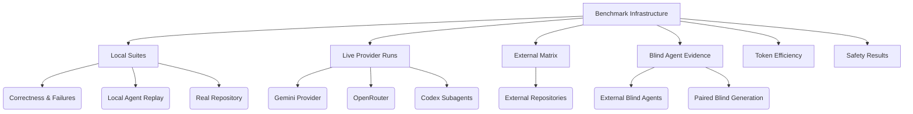

# Aether Benchmark Evidence

## Executive Summary

This report summarizes the reproducible benchmark infrastructure present in `benchmarks/`. It formalizes earlier token-savings notes with concrete evidence, distinguishing strictly observed results from claims requiring further live provider data. 

> [!NOTE]
> The benchmarks evaluate Aether's AST transformations, safety rollback mechanisms, token efficiency, and cross-language parity (Python and JavaScript) against baseline control methods.

## Benchmark Coverage Hierarchy



## What Was Observed

### Summary Table

Latest local verification during this development session:

| Suite | Mode | Records | Result |
|---|---:|---:|---|
| `correctness` | `both` | 24 | 24 passed |
| `failure-injection` | `both` | 15 | 15 passed |
| `agent` | `both` | 5 | 5 passed |
| `agent` with `command` adapter & mock provider | `both` | 5 | 5 passed |
| `agent` with `command` adapter & Gemini provider | `both` | 5 | 5 passed |
| `real-repository` | `aether` | 6 | 6 passed |
| `external-repository` | `all-modes`, 3 trials | 132 | 132 passed |
| `external-agent` blind generation | `all-modes`, 3 trials | 96 | 64 passed (16/24 generated patches) |
| `paired blind agent generation` | Aether patch vs full file, 3 trials | 42 | Aether patches 10/21; full files 17/21 |
| `transition planner projection` | external matrix, graph input-savings model | 30 task/trial groups | 28.964% token savings measured-routing; 74.479% with synthetic 80% graph-context savings |
| `context A/B` | raw source vs graph-scoped packets | 7 | 59.245% input-token savings; 100% target-symbol hit rate |
| `all` | `both` | 50 | 50 passed |
| `all` | `all-modes` | 85 | 85 passed |

### Local Suites

- **Focused Tests:** 
  - Python focused tests: 17 passed.
  - Node AST tests: 8 passed.
  - Current focused verification also passed Python AST plus rollback tests: 17 passed; Node AST plus rollback tests: 14 passed; Rust `ae-codegen`: 8 passed.
- **Agent Sessions:** A live Codex coding-agent session produced the infrastructure and bug fix summarized in `docs/development/CODEX_SESSION_EVIDENCE.md`.
- **Benchmark Analyzer:** Ran successfully on combined benchmark output in the previous slice.
- **Phase 4 (Real Repository):** Expanded local real-repository coverage (`phase4-realrepo-expanded-v2`) passed 6/6 records across real Aether Python and JavaScript files in isolated temp directories.
- **Phase 4 (Expanded All):** 
  - `phase4-expanded-all` passed 50/50 records across deterministic correctness, failure injection, replay-agent, and local real-repository tasks.
  - `phase4-expanded-all-trials3` passed 150/150 records, yielding a 100% pass rate for the expanded local tested scope.
  - Conservative combined proof scoring reached 85.615% on the single run and 83.224% with three trials.
- **Node Optimization:** Node benchmark adapter optimization prefers compiled `sdk/node/dist` over `ts-node/register`. In `optimized-node-dist-all`, the expanded suite passed 50/50 records. JavaScript Aether mean execution time dropped from 561.329 ms to 295.153 ms (47.415% lower), and matched local Aether mean execution time dropped from 335.855 ms to 202.396 ms (39.737% lower). Conservative scoring reached 86.213%.
- **Phase 6 (A/B Agent Coverage):** Expanded from 2 to 7 matched programming tasks plus 2 invalid safety tasks across Python and JavaScript. 
  - `phase6-agent-ab-expanded-replay-trials3` passed 48/48 records over three trials.
  - `phase6-agent-ab-expanded-command-mock-trials3` passed 48/48 records from task descriptors without reference patches, producing 21 matched control/Aether pairs, 6/6 invalid sensitive-path detections, and 0% false acceptance.
  - `phase6-expanded-all` passed 64/64 records. Conservative combined proof scoring reached 85.172% (live token pairs remain 10).
- **Phase Gates:** Phases 4, 5, and 6 are marked done. `benchmarks/analysis/phase_gates.py` reports `all_done=true`.
- **State-Transition Fast-Path:** (`--mode state` and `--mode all-modes`) Applies generated patches directly through the AST engine, skipping validation/snapshots/rollback. 
  - Passed 137/137 records. 
  - On 47 matched state/Aether records, state mode averaged 123.459 ms and full Aether averaged 176.240 ms (29.948% faster). 
  - `state-fastpath-all-smoke` passed 85/85 records (31.127% speed improvement).
- **Hybrid Mode:** (`--mode hybrid`) Routes tiny safe edits to control, token-efficient focused edits to state, and safety-sensitive edits to guarded Aether. `hybrid-threshold-all-smoke` passed 43/43 records. 

### Live Provider Runs

- **Gemini Smoke Run (`live-gemini-agent-check-v4`):**
  - **Provider:** `gemini-3.5-flash` via `benchmarks/agents/gemini_provider.py`.
  - **Result:** 5/5 agent records passed.
  - **Metadata:** 2,304 input tokens, 256 output tokens. 27,227.455 ms total provider latency (5,445.491 ms average).
  - **Efficiency:** Matched normal-task efficiency (100% success, 0% token delta, 58.073% lower local execution time for Aether mode). 
  - **Issues Found:** Earlier attempts exposed an incompatible structured-output request shape and insufficient patch normalization.
  - **Resilience:** The provider now retries transient 429/5xx responses but fails fast on non-retryable daily quota exhaustion.
- **OpenRouter Provider:**
  - Supported via `benchmarks/agents/openrouter_provider.py`.
  - `live-openrouter-smoke-v3` passed 5/5 records. 2,300 input tokens, 4,356 output tokens, 118,315.635 ms total latency. 100% control success, 100% Aether success, 100% invalid-patch detection.
  - Aether used 9.295% more input tokens but 83.259% fewer output tokens, 88.975% lower provider latency, and 21.129% lower local execution time.
- **Codex Subagents:**
  - `subagent-simulated-provider-smoke-v2` produced provider-like patches from descriptors, passing 5/5 records.
  - `parallel-subagent-agent-trials3` used independent subagents and passed 15/15 records.

> [!WARNING]
> Cost metadata for Gemini and OpenRouter free models were not locally configured and are omitted. Provider availability failures are now structurally separated from Aether/model success.

### External Matrix

- **Expanded External Evidence (`external-matrix-allmodes-trials3-v3`):** Passed 132/132 records across 5 immutable GitHub repositories, 12 tasks, Python/JS, and 3 trials.
- **Performance:** Hybrid vs full-file control saved 75.014% estimated output tokens, 28.842% estimated total tokens, and 79.423% emitted bytes, adding 41.323 ms mean edit-to-verified time.

### Blind Agent Evidence

- **Blind External-Agent (`blind-external-agent-trials3-v1`):** 24 independent patches over 8 tasks. 16/24 patches passed hidden behavior tests (66.667%). 
  - Structured patches used 78.231% fewer estimated output tokens and 82.802% fewer emitted bytes.
  - Mean edit-to-verified time: 228.433 ms (control), 224.467 ms (state), 339.777 ms (Aether), 194.897 ms (hybrid). 
- **Paired Blind Agent-Generation (`paired-blind-agent-trials3-v1`):** Aether-patch vs full-file outputs over 7 hidden-test tasks. 
  - Aether succeeded 10/21 (47.619%); full-file succeeded 17/21 (80.952%).
  - Aether used 3,999 estimated tokens vs 22,658 for full files (82.351% output-token savings).
  
> [!CAUTION]
> Full-file output was significantly more successful than Aether patch output in the paired blind run, highlighting that agent-facing patch generation needs more reliability work before success-rate gains can be claimed.

### Token Efficiency

- **Offline Token Estimates:** Recorded separately from billing. In `token-estimate-all-smoke`, 85/85 records passed. Overall patch output was 13.069% smaller than full target-file rewrite; state-mode patch output was 40.942% smaller.
- **Transition Planner Projection:** 
  - A token-first dynamic planner reduced estimated total tokens by 28.964% while increasing local edit-to-verified time.
  - A graph-context projection with synthetic 80% input-token reduction reduced estimated total tokens by 74.479%.
- **Context A/B Evidence (`context-ab-paired-v1`):** Raw full-source packets vs graph-scoped packets. Graph-scoped context used 3,908 tokens vs 9,589 raw (59.245% reduction). Target-symbol hit rate was 100%.

### Safety Results

- **Phase 5 (Cross-Language Parity):** `phase5-crosslang-failure-parity` passed 18/18 records, covering syntax errors, runtime errors, broken imports, timeouts, and sensitive-path rejection in both Python and JavaScript.
- **Expanded Cross-Language:** `phase5-crosslang-all` passed 53/53 records. JavaScript coverage increased to 25 records.

## Issue Found And Fixed During Real-Repo Smoke Work

> [!IMPORTANT]
> A Python import insertion path previously placed imports before `from __future__ import annotations`, causing a syntax error. This was exposed during real-repository testing and is now fixed in the Python AST engine.

## What This Proves So Far

In the tested configuration:

- The benchmark runner produces raw JSON and CSV records with commit/environment metadata.
- Python and JavaScript valid AST transformations pass deterministic behavior checks.
- Python and JavaScript invalid patches are rejected by Aether validation.
- Python and JavaScript schema-valid AST apply failures trigger snapshot-backed rollback in Aether mode.
- Python and JavaScript failure-injection suites now cover matching syntax, runtime, broken-import, timeout, and sensitive-path classes for the benchmark-supported paths.
- Replay-agent tasks can run in matched `control` and `aether` modes from the same patch-producing adapter.
- The A/B agent benchmark now covers multiple operation types in matched control/Aether mode: Python modify-function, import update, block replacement, JavaScript modify-function, add-function, remove-function, and block replacement.
- Command-agent tasks can ingest provider-shaped usage metadata: model, input/output tokens, tool calls, attempts, latency, and cost.
- Gemini-backed command-agent tasks can run through the live provider path with retry, token, latency, model, and patch-size metadata.
- Command/provider task descriptors no longer include the reference patch, so live provider runs are not handed the answer key.
- Users can choose a raw state-transition path when they need the base mechanism without the full validation/snapshot/rollback envelope.
- Users can choose a hybrid threshold policy that routes tiny first-draft/safe edits to control, token-efficient focused edits to state, and safety-sensitive edits to full Aether.
- A benchmark-only transition planner can now estimate dynamic method selection across full-file, state, guarded Aether, existing hybrid, and graph-scoped variants with configurable graph context savings and latency weighting.
- Lightweight graph-scoped context packets can reduce visible input context on the paired external tasks while still selecting the named target symbol.
- Local real-repository fixtures copied from this repository can be patched and verified in isolated temp projects across Python and JavaScript files.
- The expanded local benchmark can be repeated over three trials with 100% task success, 100% Aether invalid-patch detection, 0% false acceptance, and 100% rollback success for rollback-triggering cases.
- The Phase 4/5/6 acceptance gates are machine-checkable and currently pass for the local reproducible benchmark scope.
- External git repository manifests, immutable checkout caching, full-file control baselines, state/Aether/hybrid matching, and per-repository efficiency reporting are supported behind `--allow-network-repos`. The current five-repository matrix passed 132/132.
- Source-only blind-agent packets, hash-locked generated-patch replay, hidden tests, and a manual CI workflow now provide leak-resistant unseen-task evidence. The first final run passed 16/24 independent generations without answer-key normalization.
- A matched blind full-file-generation control arm now exists. On the first 7-task run, full-file generation was more successful than Aether patch generation, while Aether retained large output-token savings. This proves the token-efficiency mechanism but shows agent-facing patch generation needs more reliability work before claiming success-rate gains.
- The result schema now includes retry, token, tool-call, latency, and cost fields for live/provider adapters.
- The result schema now also supports offline estimated-token fields without mixing them into provider-reported billing telemetry.
- Python import insertion now preserves module docstrings and `from __future__` ordering in the tested AST and real-repository cases.
- In this Codex session, an AI coding agent found and fixed a real implementation bug, then added regression coverage and benchmark verification.

## What This Does Not Prove Yet

These claims remain outside the Phase 4/5/6 local completion gates and should be handled in Phase 7/public replication:

- Whether Aether makes agents more successful than a matched full-file-generation control. The first paired blind run showed the opposite on this small task set: full-file output was more successful, while Aether patch output was much smaller.
- Whether the observed external token savings hold beyond the current five repositories and ten valid edit tasks.
- Whether the expanded A/B agent result holds for external live providers rather than local replay/mock providers.
- Whether the measured external latency tradeoff remains favorable with real model generation, retries, and provider billing.
- Whether the benchmark adapter/runtime overhead can be reduced enough for Aether to beat direct string edits on very small local files.
- Whether state-transition mode beats direct control on larger real edits and live-agent loops where structured edit correctness may reduce retries.
- Whether JavaScript rollback safety is broadly comparable to Python across larger external repositories and still more failure classes.
- Whether broader external git repository benchmarks remain stable across CI/network environments.
- Whether blind generation results reproduce under an OS-enforced agent sandbox; the current source-only restriction was enforced by prompts and independently checked packet contents.
- Whether better patch schemas, examples, constrained decoding, or repair loops can close the paired blind success gap without giving back the observed output-token savings.
- Whether a real Graphify-style code graph, measured inside the benchmark harness, delivers the projected input-token savings once graph build/update time and query accuracy are included.
- Whether live agents can preserve or improve correctness when given graph-scoped packets instead of raw full-source packets.

## How To Reproduce

From the repository root, after installing Python SDK dependencies and Node dependencies:

```bash
python benchmarks/run.py --suite correctness --mode both --trials 1
python benchmarks/run.py --suite agent --mode both --trials 1
python benchmarks/run.py --suite real-repository --mode aether --trials 1
```

Use a live/provider command adapter when available:

```bash
python benchmarks/run.py --suite agent --mode both --agent-adapter command --agent-command <your-agent-command>
```

> [!TIP]
> OpenAI provider command support is available through `benchmarks/agents/openai_provider.py`; it requires `OPENAI_API_KEY` and `AETHER_OPENAI_MODEL`.
> 
> Gemini provider command support is available through `benchmarks/agents/gemini_provider.py`; it requires `GEMINI_API_KEY` and `AETHER_GEMINI_MODEL`.

Raw results are written to `benchmarks/results/raw/`; processed CSV files are written to `benchmarks/results/processed/`.
