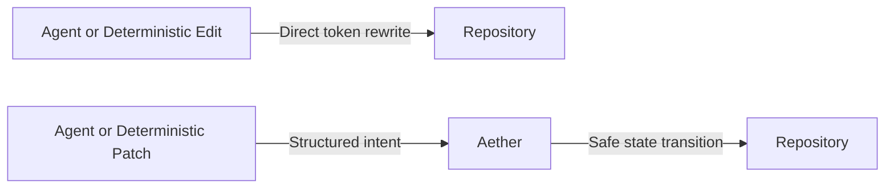

# Benchmark Methodology

## Scope

The benchmark program measures observed behavior in specific, reproducible configurations. It must not be used to claim universal safety, correctness, or performance.

## Experimental Design

The intended primary variable is the presence of Aether. For agent benchmarks, these variables must remain constant across conditions:

- Model, prompt, and temperature
- Task and starting commit
- Environment, timeout, and attempt count

> [!NOTE]
> Below is the workflow comparison between the Control setup and the Aether experimental setup.



## Result Recording

Raw result records are written to:
```text
benchmarks/results/raw/
```

Processed CSV summaries are written to:
```text
benchmarks/results/processed/
```

Raw JSON can be summarized with:
```bash
python benchmarks/analysis/summarize.py benchmarks/results/raw/<run>.json
```

Every result should include:
- Experiment ID, timestamp, and commit SHA
- Task ID, repository, and language
- Agent/model metadata (when available)
- Configuration and patch size (when available)
- Token/tool-call counts (when measured)
- Agent retry count, adapter latency, and cost (when measured)
- Execution and validation timing
- Repository setup, verification, edit-to-verified, and total task timing
- Source, repository, emitted-output, and full-rewrite byte sizes
- Test outcomes
- Syntax/runtime/validation flags
- Rollback flags and task success
- Repository corruption flag and error type
- Provider error type, HTTP status, retryability, and quota-exhaustion flags
- Task category (when available)
- Failure type and detection status for injected-failure tasks
- Repository manifest for real-repository tasks

> [!IMPORTANT]
> Unknown measurements should be `null`, not estimated.

## Live Provider Adapter Contract

The command-backed adapter expects the provider command to read a task descriptor from `stdin` and write JSON to `stdout`. For live/provider runs, the descriptor includes task description, source file path, source content, test command, timeout, and schema guidance; it does not include the reference manifest patch. The replay adapter is the only adapter that receives the reference patch by design.

The provider output may be either a patch object or an envelope:

```json
{
  "patch": {
    "schema_version": "1.0",
    "patch_id": "00000000-0000-4000-8000-000000000000",
    "action": "modify_function",
    "target": { "file": "app.py", "symbol": "total", "symbol_type": "function" },
    "changes": { "operation": "replace_body", "payload": "return 42\n" },
    "metadata": { "agent_id": "provider-agent", "model": "model-name" }
  },
  "usage": {
    "input_tokens": 100,
    "output_tokens": 50,
    "tool_calls": 1,
    "latency_ms": 1200,
    "cost_usd": 0.001,
    "model": "model-name"
  }
}
```

Run it with:
```bash
python benchmarks/run.py --suite agent --mode both --agent-adapter command --agent-command <your-agent-command>
```

### Supported Providers

**OpenAI Wrapper:**
```bash
set OPENAI_API_KEY=<key>
set AETHER_OPENAI_MODEL=<model>
python benchmarks/run.py --suite agent --mode both --agent-adapter command --agent-command "python benchmarks/agents/openai_provider.py"
```
The wrapper uses OpenAI's Responses API text format configuration for structured JSON output and relies on local Aether validation before a patch is accepted.

**Gemini Wrapper:**
```bash
set GEMINI_API_KEY=<key>
set AETHER_GEMINI_MODEL=gemini-3.5-flash
python benchmarks/run.py --suite agent --mode both --agent-adapter command --agent-command "python benchmarks/agents/gemini_provider.py"
```
The wrapper uses Gemini `generateContent` with JSON response formatting and relies on local Aether validation before a patch is accepted.
> [!WARNING]
> Gemini transient `429`/`5xx` responses are retried inside the provider wrapper using parsed retry delays. Daily free-tier quota exhaustion is treated as non-retryable and should be reported as provider infrastructure failure, not as model quality, Aether safety, or false-acceptance evidence.

**OpenRouter Wrapper:**
```bash
set OPENROUTER_API_KEY=<key>
set AETHER_OPENROUTER_MODEL=<model-or-openrouter/free>
python benchmarks/run.py --suite agent --mode both --agent-adapter command --agent-command "python benchmarks/agents/openrouter_provider.py"
```
The wrapper uses OpenRouter's OpenAI-compatible chat-completions endpoint. For reproducible evidence, prefer a pinned `:free` model slug. Use `openrouter/free` only for smoke checks where free-model routing variance is acceptable. OpenRouter transient `429`/`5xx` responses are retried with parsed retry delays; daily quota or insufficient-credit failures should be reported as provider infrastructure failures.

## External Repository Runs

External git repository benchmarks require an explicit network flag:

```bash
python benchmarks/run.py --suite external-repository --mode all-modes --trials 3 --allow-network-repos
```

> [!CAUTION]
> Manifests must pin immutable commit SHAs. Branch names are not acceptable evidence pins.

The deterministic external control condition emits the complete transformed source file. State and Aether emit structured patch JSON. Both conditions receive the same source and task description, but each input includes its actual output contract. Offline token comparisons use the recorded tokenizer and must remain separate from live provider telemetry.

Repository setup is measured independently and excluded from raw edit execution. `edit_to_verified_time_ms` includes transformation, syntax checking, and the task's declared verification command. Deterministic runs do not claim model generation latency.

### Blind Agent Generation

Unseen-agent evidence uses fresh opaque task IDs and separates the visible packet from the evaluator. The visible packet may contain only the natural-language task, pinned source, target file, language, and public patch contract. Tests, expected output, reference patches, failure labels, and acceptance criteria remain hidden until after generation. Every packet and returned patch is hashed before matched control/state/Aether/hybrid application.

Provider normalization must not infer semantic patch fields from the evaluator. Prompt-enforced file restrictions and stored subagent replay are useful local evidence, but they must be labeled separately from OS-sandboxed agents and live provider telemetry.

## Statistical Reporting

Use confidence intervals or statistical tests only when the sample size and task distribution support them. For each important metric, report the following:

| Metric Type | Reported Values |
| --- | --- |
| **Base Statistics** | N, mean, median, standard deviation, minimum, maximum |
| **Comparative Statistics (Control vs. Aether)** | Absolute difference, relative difference, success-rate difference, failure-detection-rate difference |

## Evidence Language

Each evidence report should separate observed result, inference, hypothesis, limitation, and future work.

**✅ Prefer:**
```text
In this tested configuration, no syntax errors were observed in N cases.
```

**❌ Avoid:**
```text
Aether guarantees syntactic correctness.
```
