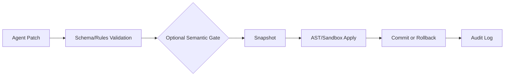
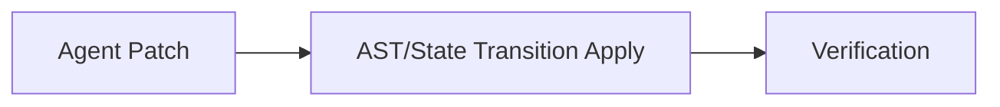

# 📊 Current State

> [!CAUTION]
> This audit reflects the repository as inspected for Milestone M0. It treats the existing benchmark numbers as preliminary evidence and does not treat any current result as a general safety or performance claim.

## 🏗️ Architecture

Aether currently combines three related systems:

| System | Path | Description |
|---|---|---|
| **Rust Workspace** | `crates/` | Original Aether language compiler, semantic analysis, code generation, CLI, and LSP support. |
| **Python SDK** | `sdk/python/ai_runtime/` | Structured patch validation, AST patch application, sandbox execution tiers, snapshots, rollback, and observability. |
| **Node.js SDK** | `sdk/node/src/` | Schema/security validation, AST patching through Recast, subprocess sandboxing, snapshots, and tests. |

### Primary AI-Safe Runtime Path



### Speed-First State-Transition Path

> [!WARNING]
> This `state` mode is intentionally lighter than full Aether. It is useful for measuring the base structured-edit mechanism without validation, snapshots, rollback, or audit overhead, but it should not be presented as equivalent safety.



### Important Reusable Components

| Language | Component Path | Purpose |
|---|---|---|
| Python | `sdk/python/ai_runtime/patch_engine.py` | Patch engine |
| Python | `sdk/python/ai_runtime/orchestrator.py` | Orchestrator |
| Python | `sdk/python/ai_runtime/ast/engine.py` | AST engine |
| Python | `sdk/python/ai_runtime/snapshot/store.py` | Snapshot store |
| Python | `sdk/python/ai_runtime/sandbox*.py` | Sandboxing |
| Python | `sdk/python/ai_runtime/validation/*` | Validation rules |
| Python | `sdk/python/ai_runtime/observability/*` | Observability/Audit |
| Node.js | `sdk/node/src/patch_engine.ts` | Patch engine |
| Node.js | `sdk/node/src/ast/engine.ts` | AST engine |
| Node.js | `sdk/node/src/snapshot/*` | Snapshots |
| Shared | `sdk/security_rules.json` | Security rules |

## ✨ Existing Capabilities

### Validation
- JSON Schema validation for patch structure.
- Shared security rules that block sensitive paths and suspicious payload patterns.
- Optional semantic bridge through `ae check` when `ae_target` is provided.

### Patch Application
- Python AST patching via LibCST.
- Node.js/TypeScript-oriented AST patching via Recast.
- Supported patch actions include `modify_function`, `add_function`, `remove_function`, `modify_class`, `update_import`, `replace_block`, and `run_script`.

### Snapshot and Rollback
- Python `SnapshotStore` captures gitignore-aware source archives as `.tar.gz`.
- Snapshot metadata is indexed in SQLite with WAL enabled.
- Restore overwrites modified files and removes new source files that were not in the snapshot manifest.
- Sandbox integration records snapshot and rollback audit events.

### Sandboxing
- Python has T1 Cranelift FFI, T2 Wasmtime/WASI, and T3 subprocess paths.
- Node has a T3 subprocess sandbox and N-API scaffold for T1.
- Security documentation clearly describes tier limitations.

### Observability
- Python audit log records validation, snapshot, execution, rollback, and commit events.
- Existing tests query audit events for rollback behavior.

## 🧪 Existing Tests

| Area | Testing Status |
|---|---|
| **Rust** | Workspace crates include unit tests, especially in `ae-codegen` for JIT and FFI guard behavior. |
| **Python** | Tests cover validation, sandbox behavior, snapshot capture/restore, observability, AST patching, rollback fault injection, orchestrator behavior, and FFI fuzzing. (The README claims 174 Python tests; benchmark runner records actual executed counts for benchmark tasks only). |
| **Node.js** | Jest tests cover AST patching, snapshot, rollback fault behavior, sandbox, validation, semantic gate, and security. `sdk/node/package.json` currently has a placeholder `npm test` script that fails. CI should call Jest directly or update the script in a later milestone. |
| **CI** | `.github/workflows/benchmark-smoke.yml` now runs a benchmark smoke suite on PRs and pushes to `main`/`master`. |

## 📈 Existing Benchmarks

Existing benchmark material:
- `benchmark_evidence.md`
- `.benchmarks/`
- `scratch/run_benchmark.py`
- `scratch/run_real_benchmark.py`
- `scratch/run_live_benchmark.py`
- `scratch/run_incremental_benchmark.py`
- `scratch/build_whole_code_benchmark.py`
- `scratch/benchmark_results.md`

> [!IMPORTANT]
> Current benchmark evidence is useful for hypothesis generation but is not yet a reproducible benchmark system. Several claims use strong wording such as "guarantees" or "100% safe"; future evidence reports should qualify such language as tested behavior in specific configurations.

## 🏗️ Benchmark Infrastructure Now Present

- Canonical `benchmarks/` directory with stable task/config/result layout.
- Machine-readable raw result schema.
- Reproducible benchmark runner with commit SHA and environment metadata.
- CSV/processed output.
- Stable correctness, cross-language failure-injection, agent replay, and expanded local real-repository task manifests.
- Statistical aggregation over repeated trials.
- Matched control-vs-Aether execution for deterministic and replay-agent tasks where supported.
- Replay and command-backed agent adapter contract.
- Expanded A/B agent task set covering seven matched Python/JavaScript programming operations plus invalid sensitive-path safety tasks.
- Machine-checkable Phase 4/5/6 completion gates in `benchmarks/analysis/phase_gates.py`; the current gate evidence marks all three done for the reproducible local benchmark scope.
- State-transition fast-path benchmarking through `--mode state` and `--mode all-modes`, with `benchmarks/analysis/state_efficiency.py` for control/state/Aether comparisons.
- Live Gemini provider command smoke run with token, latency, retry, and model metadata.
- Local real-repository fixtures covering isolated Aether Python and JavaScript files.
- Pinned external GitHub coverage for MarkupSafe, Packaging, Requests, escape-string-regexp, and yocto-queue through `--suite external-repository --allow-network-repos`, including matched full-file control/state/Aether/hybrid records and external Python/JavaScript rollback.
- Dedicated external efficiency analysis with tokenizer estimates, emitted bytes, setup/apply/verification timing, bootstrap intervals, hybrid routing, and source-size buckets.
- Manual GitHub Actions workflow for cached three-trial external validation and artifact publication.
- Blind external-agent protocol with source-only packets, hidden behavior checks, immutable descriptor/patch hashes, three independent agent trials, and a manual CI evidence workflow.
- Paired blind agent-generation protocol comparing Aether structured patches against matched full-file outputs on the same source-only tasks, with task/trial pair ids, hidden tests, estimated token/byte metrics, exact McNemar reporting, and task-clustered bootstrap intervals.
- Benchmark-only transition planner analysis for full-file, state, guarded Aether, existing hybrid, and synthetic graph-scoped variants, documented in `docs/development/COMPILER_TRANSITION_PLANNER.md`.
- Lightweight graph-scoped context A/B runner measuring raw-source versus selected-symbol packets, input-token savings, target-symbol hit rate, and graph build time.
- Benchmark smoke CI workflow.
- Documentation for adding benchmarks and language adapters.

## 🚧 Remaining Infrastructure Gaps

- Repeated live/provider benchmark records across larger task sets with configured cost rates.
- Live-provider A/B runs on the expanded Phase 6 agent task set. The expanded A/B task set has passed the local command/mock completion gate, but it has not yet been repeated against live Gemini/OpenRouter after expansion.
- External coverage beyond the current five repositories and twelve tasks, including dependency-installed project test suites, TypeScript, and multi-file changes.
- Fresh unpublished tasks for every public rerun, OS-enforced filesystem isolation during generation, and improved Aether patch-generation reliability versus full-file agent output.
- Live-agent graph-context correctness A/B: graph-scoped packets now measure input savings, but they still need matched agent generation and hidden-test scoring against raw-source packets.
- Full Graphify-style repository graph integration: graph update time, query token cost, raw file-read tokens avoided, scoped-context correctness, and planner decisions with latency weighting.
- CI coverage for full SDK unit tests and full benchmark suites.

## ⚠️ Risks

> [!WARNING]
> - Benchmark contamination if results are edited by hand or generated from non-pinned repositories.
> - Overstated safety claims if benchmark results are presented as universal guarantees.
> - State-transition mode can improve speed by skipping safety work, but it does not provide Aether validation/snapshot/rollback protection.
> - Node test discoverability risk because `npm test` is currently a failing placeholder.
> - Cross-language parity risk is reduced for the benchmark-supported paths: Python and JavaScript failure-injection now cover syntax, runtime, broken-import, timeout, and sensitive-path classes where applicable. Larger external repositories and additional JS/TS failure classes still need coverage.
> - Snapshot risk around permission failures, symlinks, locked files, and corrupted archives. Some of these are tested, but they are not exhaustive.
> - Agent A/B risk if prompts, model settings, retries, or timeouts differ between control and Aether runs.

## 📐 Proposed Testing Architecture

Use three layers:

- Unit and integration tests remain in each SDK and crate.
- Benchmark smoke tests live in `benchmarks/` and run quickly in CI.
- Full benchmarks run manually or on a schedule and write raw immutable JSON output.

### Initial Benchmark Structure

```text
benchmarks/
  README.md
  config/
    default.json
    result_schema.json
  tasks/
    correctness_smoke.json
  datasets/
    README.md
  runners/
    README.md
  agents/
    README.md
  adapters/
    README.md
  analysis/
    README.md
  results/
    raw/
    processed/
    figures/
  run.py
```

> [!NOTE]
> The runner now covers deterministic correctness, cross-language failure injection, expanded A/B agent replay, command-agent provider ingestion, live provider smoke runs, source-only blind subagent generation, local real-repository fixtures, a five-repository external matrix with matched efficiency and rollback evidence, and paired blind Aether-patch versus full-file generation. The first blind patch run passed 16/24 independently generated patches over eight hidden-test tasks, while preserving all failed patches. The first paired blind run passed 10/21 Aether patch outputs versus 17/21 full-file outputs, while Aether used 82.351% fewer estimated output tokens. Later milestones should add OS-enforced generation isolation, repeated live-provider runs, dependency-installed external suites, broader task coverage, multi-file transitions, and patch-generation repair loops.
