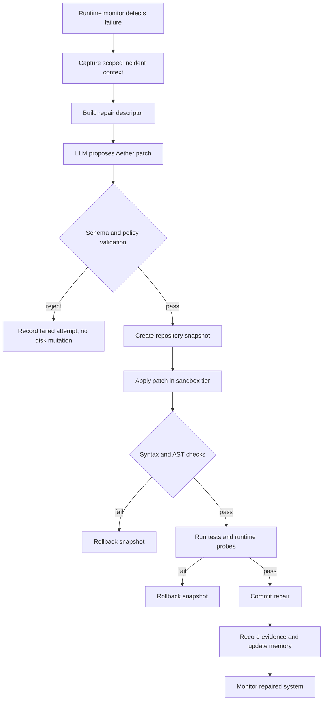

# Aether Healing Loop Architecture

This document describes how an Aether-backed system can perform autonomous healing and controlled evolution without letting an LLM mutate the codebase directly.

## Control Loop



## Loop Roles

### Monitor

The monitor observes system health and triggers healing when it detects:

- exceptions
- failed tests
- startup failure
- schema mismatch
- dependency/import failure
- latency regression
- memory/cpu threshold breach
- failed user workflow

### Orienter

The orienter collects only the context required for the repair:

- failing stack trace
- target source file
- nearby symbols
- test command
- recent logs
- dependency metadata
- expected behavior
- current repository hash

This step is where context compression systems such as graph-based retrieval can combine with Aether. The system should read less and write less.

### Decider

The decider asks an LLM or local model for a structured transition:

```json
{
  "schema_version": "1.0",
  "action": "modify_function",
  "target": {
    "file": "service.py",
    "symbol": "parse_payload",
    "symbol_type": "function"
  },
  "changes": {
    "operation": "replace_body",
    "payload": "..."
  }
}
```

The LLM still reasons about the fix, but it does not get unrestricted write authority.

### Actuator

The actuator is Aether:

- validate patch shape
- reject unsafe targets
- snapshot current state
- apply language-aware transformation
- run syntax checks
- run tests/probes
- commit or rollback
- emit evidence

## Safety Invariant

The central safety invariant is:

> A rejected or failed autonomous repair must not leave the repository in a worse state than before the repair attempt.

Benchmark checks should verify this by hashing repository state before and after failed repairs.

## Evolution Loop

Evolution uses the same machinery, but the trigger is optimization rather than failure:

```text
observe code smell or performance issue
  -> propose small improvement
  -> validate patch
  -> benchmark or test
  -> keep if improvement passes threshold
  -> rollback otherwise
```

Example evolution tasks:

- replace slow path with cached path
- simplify repeated branch logic
- add missing tests around high-risk code
- migrate deprecated API calls
- harden input validation
- remove unused imports

## Why Aether Is Different From a Backup

A backup helps after damage. Aether aims to prevent unsafe mutation from becoming damage.

Traditional self-healing systems often do:

```text
LLM generates code -> write file -> run test -> restore backup if broken
```

Aether moves checks earlier:

```text
LLM generates state transition -> validate -> snapshot -> sandbox -> verify -> commit
```

This makes the healing loop closer to a compiler pipeline than a text editor.

## Measurements

Every healing attempt should record:

- incident id
- source repository hash before repair
- patch id
- patch schema validation result
- sandbox tier
- syntax result
- test result
- rollback triggered
- rollback success
- repository hash after repair
- input tokens
- output tokens
- latency
- cost
- final decision

That evidence is what turns self-healing from a demo into an auditable autonomous system.
